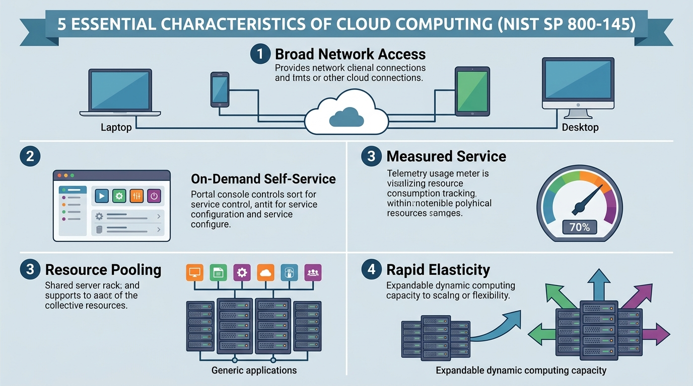
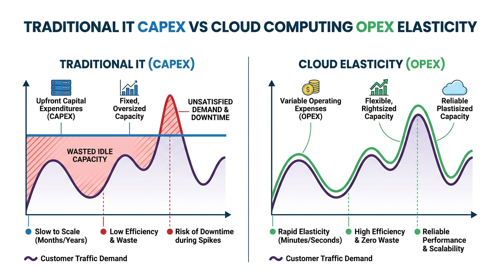

# Pertemuan 01: Pengantar dan Konsep Dasar Komputasi Awan

**Mata Kuliah:** Komputasi Awan (*Cloud Computing*)  
**Kode MK / Bobot:** TI433946 / 3 SKS  
**Sub-CPMK:** Mahasiswa mampu menguasai dan memahami Dasar Komputasi Awan, Infrastruktur, & Teknologi Pendukung Cloud (Sub-CPMK 1 & 3).

---

## 1. Tujuan Pembelajaran
Setelah menyelesaikan materi pada pertemuan ini, mahasiswa diharapkan mampu:
1. Menjelaskan definisi formal *Cloud Computing* berdasarkan standar NIST dan ISO/IEC secara komprehensif.
2. Menganalisis 5 karakteristik esensial komputasi awan beserta implikasi teknologinya.
3. Membedakan paradigma ekonomi komputasi tradisional (*CAPEX*) dengan model komputasi awan (*OPEX*).
4. Menilai urgensi, manfaat bisnis, serta pertimbangan etis dan tata kelola dalam adopsi komputasi awan bagi institusi modern.

---

## 2. Definisi Formal Komputasi Awan

### 2.1 Definisi NIST (*National Institute of Standards and Technology*)
Berdasarkan dokumen **NIST SP 800-145**, Komputasi Awan (*Cloud Computing*) didefinisikan sebagai:
> *"Sebuah model yang memungkinkan akses jaringan yang nyaman dan sesuai permintaan (on-demand) ke kumpulan sumber daya komputasi yang dapat dikonfigurasi bersama (misalnya jaringan, server, media penyimpanan, aplikasi, dan layanan) yang dapat disediakan dan dirilis dengan cepat melalui upaya manajemen yang minimal atau interaksi penyedia layanan yang sangat sedikit."*

### 2.2 Definisi ISO/IEC 17788
Standar internasional ISO/IEC 17788 mendefinisikan *cloud computing* sebagai paradigma untuk menyediakan kapabilitas jaringan ke kumpulan sumber daya fisik dan virtual yang terukur (*scalable*) dan elastis (*elastic*) dengan penyediaan swalayan (*self-service provisioning*) dan administrasi sesuai permintaan (*on-demand administration*).

Secara fundamental, cloud computing bukanlah satu jenis teknologi tunggal, melainkan **konvergensi paradigma arsitektur** yang memadukan sistem terdistribusi, virtualisasi perangkat keras, otomatisasi orkestrasi, dan model penetapan harga berbasis utilitas (*utility pricing*).

---

## 3. Lima Karakteristik Esensial (NIST Standard)

Agar suatu infrastruktur dapat diklasifikasikan secara sah sebagai layanan komputasi awan, sistem tersebut **wajib memenuhi kelima karakteristik berikut**:

```
+-----------------------------------------------------------------------+
|                       5 KARAKTERISTIK ESENSIAL CLOUD                  |
+-----------------------------------------------------------------------+
|  1. On-Demand Self-Service    --> Provisioning mandiri tanpa manusia  |
|  2. Broad Network Access      --> Diakses standar lewat IP / Web / API|
|  3. Resource Pooling          --> Multi-tenancy & isolasi beban kerja |
|  4. Rapid Elasticity          --> Skalasi dinamis (Scale Out / In)    |
|  5. Measured Service          --> Transparansi penagihan & telemetri  |
+-----------------------------------------------------------------------+
```


*Gambar 1.1: Diagram Arsitektur Ekosistem 5 Karakteristik Esensial Cloud Computing menurut NIST SP 800-145.*

### 1. *On-demand Self-service* (Swalayan Sesuai Kebutuhan)
Konsumen dapat secara mandiri memesan, mengonfigurasi, dan mengaktifkan kemampuan komputasi—seperti waktu server, kapasitas jaringan, dan volume penyimpanan—secara instan melalui antarmuka web konsol, CLI, atau API tanpa memerlukan intervensi interaksi manual dari staf teknis penyedia layanan.
- **Dampak Teknis:** Waktu penyediaan infrastruktur berkurang dari hitungan minggu/bulan (pada era server fisik) menjadi hitungan detik/menit.

### 2. *Broad Network Access* (Akses Jaringan yang Luas)
Kapabilitas komputasi tersedia melalui jaringan standar (terutama Internet publik atau jaringan privat tertutup) dan dapat diakses menggunakan mekanisme standar yang mempromosikan interoperabilitas berbagai platform klien (misalnya komputer desktop, laptop, tablet, ponsel pintar, ataupun perangkat IoT).
- **Dampak Teknis:** Standarisasi protokol akses (HTTP/HTTPS, RESTful API, gRPC, SSH, RDP).

### 3. *Resource Pooling* (Pengumpulan Sumber Daya Bersama)
Penyedia layanan mengumpulkan sumber daya komputasi fisik ke dalam satu wadah (*pool*) besar untuk melayani banyak konsumen menggunakan model **Multi-tenant**. Sumber daya fisik dan virtual dialokasikan dan dialokasikan ulang secara dinamis sesuai kebutuhan konsumen.
- Konsumen umumnya tidak mengetahui atau mengendalikan lokasi fisik pasti dari sumber daya tersebut (meskipun mereka dapat menentukan level abstraksi lokasi yang lebih tinggi seperti *Region*, Negara, atau *Availability Zone*).
- **Mekanisme Kunci:** Isolasi virtual melalui *Hypervisor*, *Kernel Namespaces*, dan *VLAN/VXLAN*.

### 4. *Rapid Elasticity* (Elastisitas Cepat)
Kemampuan komputasi dapat disediakan dan dilepaskan secara elastis, bahkan dalam beberapa kasus terjadi secara otomatis, untuk menyesuaikan kebutuhan beban kerja (*workload*) secara dinamis. Bagi konsumen, kapasitas yang tersedia tampak tidak terbatas dan dapat dibeli dalam jumlah berapapun pada waktu kapanpun.
- **Scale-Up / Scale-Down (Vertikal):** Mengubah spesifikasi mesin (misal: 4 vCPU menjadi 16 vCPU).
- **Scale-Out / Scale-In (Horizontal):** Menambah atau mengurangi jumlah instans mesin yang berjalan secara paralel di balik penyeimbang beban (*load balancer*).

### 5. *Measured Service* (Layanan Terukur)
Sistem cloud secara otomatis mengontrol, memantau, dan mengoptimalkan penggunaan sumber daya dengan memanfaatkan kemampuan pengukuran (*metering capability*) pada tingkat abstraksi yang sesuai dengan jenis layanannya (misalnya kapasitas penyimpanan, pemrosesan CPU, konsumsi memori, bandwidth jaringan, atau akun pengguna aktif).
- **Prinsip Dasar:** *"Pay-as-you-go"* (Bayar sesuai apa yang Anda gunakan secara riil). Konsumen dan penyedia memiliki visibilitas transparan terhadap telemetri konsumsi.

---

## 4. Paradigma Ekonomi: Pergeseran CAPEX ke OPEX

Salah satu alasan terbesar mengapa industri beralih secara masif ke komputasi awan adalah transformasi model finansial dalam penyediaan teknologi informasi:

| Indikator Evaluasi | Model Tradisional (On-Premise) | Model Komputasi Awan (Cloud) |
| :--- | :--- | :--- |
| **Model Biaya Utama** | **CAPEX** (*Capital Expenditure*) | **OPEX** (*Operational Expenditure*) |
| **Investasi Awal** | Sangat besar (pembelian server fisik, lisensi, ruang data center, pendingin, genset). | Nol atau sangat kecil (hanya butuh kartu kredit/kredit akun cloud). |
| **Penyusutan Nilai** | Aset fisik mengalami depresiasi nilai dalam 3–5 tahun. | Tidak ada depresiasi aset (dihitung sebagai biaya operasional berjalan). |
| **Kapasitas Perencanaan** | Wajib *over-provisioning* mengantisipasi beban puncak 3 tahun ke depan (berisiko mubazir). | Fleksibel (*just-in-time capacity*), sumber daya dialokasikan saat trafik datang. |
| **Biaya Pemeliharaan** | Memerlukan tim teknisi fasilitas fisik (listrik, pendingin ruangan, keamanan fisik). | Ditanggung sepenuhnya oleh penyedia cloud (*cloud vendor*). |
| **Time-to-Market** | 1 hingga 3 bulan untuk pengadaan hardware baru. | Hitungan menit untuk meluncurkan arsitektur global. |


*Gambar 1.2: Grafik Perbandingan Alokasi Kapasitas dan Risiko Biaya: Model Tradisional (CAPEX Over-provisioning) vs Model Elastisitas Cloud (OPEX Just-in-Time).*


---

## 5. Motivasi Bisnis dan Penggerak Adopsi Cloud

1. **Kelincahan Bisnis (*Business Agility*):** Tim pengembang (*developer*) dapat melakukan eksperimen fitur dan produk baru dengan cepat tanpa harus menunggu pengadaan perangkat keras.
2. **Ketersediaan Tinggi & Ketahanan Bencana (*High Availability & Disaster Recovery*):** Data dapat direplikasi ke berbagai pusat data global secara geografis terpisah untuk memastikan kelangsungan bisnis jika terjadi bencana alam.
3. **Jangkauan Global Instan (*Global Footprint*):** Aplikasi dapat dideploy ke berbagai belahan dunia dalam hitungan detik, mendekatkan latensi ke pengguna akhir.
4. **Fokus pada Nilai Inti Organisasi:** Organisasi dapat memfokuskan sumber daya manusianya pada inovasi produk dan kepuasan pelanggan, bukan pada pemeliharaan kabel dan kipas server.

---

## 6. Integrasi Nilai Etika dan Tata Kelola (CPL02)

Dalam konteks pengembangan keilmuan informatika yang beradab dan bertanggung jawab (*Islamisasi dan Etika Ilmu Pengetahuan*):
- **Amanah Efisiensi Sumber Daya:** Komputasi awan mengajarkan prinsip anti-mubazir (*israf*). Server lokal yang terus menyala dengan utilisasi hanya 5% membuang energi listrik dan menghasilkan jejak karbon (*carbon footprint*) yang merugikan lingkungan. Model pooling dan auto-scaling memaksimalkan efisiensi energi.
- **Integritas Privasi Data:** Kemudahan menyimpan data dalam skala masif di cloud menuntut tanggung jawab moral yang tinggi untuk menjaga kerahasiaan data pengguna serta mencegah penyalahgunaan wewenang akses.

---

## 7. Latihan Analisis & Diskusi Kelas

### Skenario Kasus:
Sebuah universitas sedang merencanakan sistem Pengisian Kartu Rencana Studi (KRS) daring. Sistem ini hanya mengalami lonjakan trafik yang ekstrem selama **3 hari di awal semester** (ribuan mahasiswa mengakses serentak), sementara pada sisa hari dalam semester tersebut trafik sistem mendekati nol.

### Pertanyaan Analisis:
1. Jika universitas menggunakan pendekatan *On-Premise Data Center*, jelaskan dilema teknis dan finansial yang dihadapi!
2. Bagaimana karakteristik *Rapid Elasticity* dan *Measured Service* dari Cloud Computing memberikan solusi yang paling optimal untuk kasus KRS tersebut?
3. Sebutkan risiko yang mungkin dihadapi universitas jika sistem tersebut dipindahkan ke cloud publik, serta langkah mitigasi awalnya!
