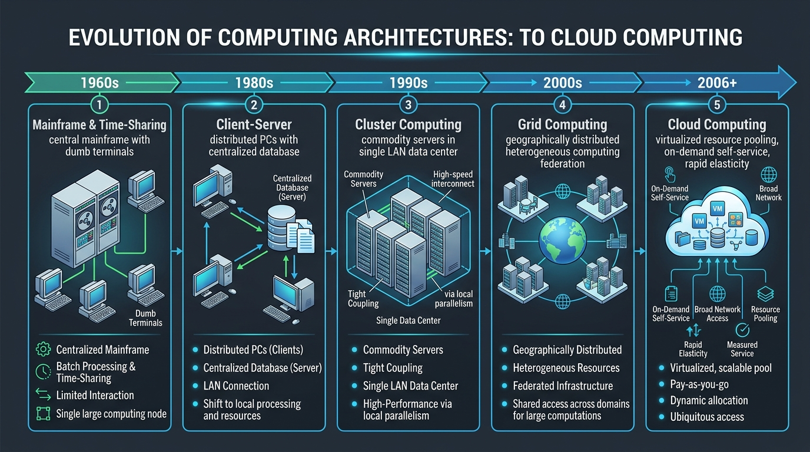
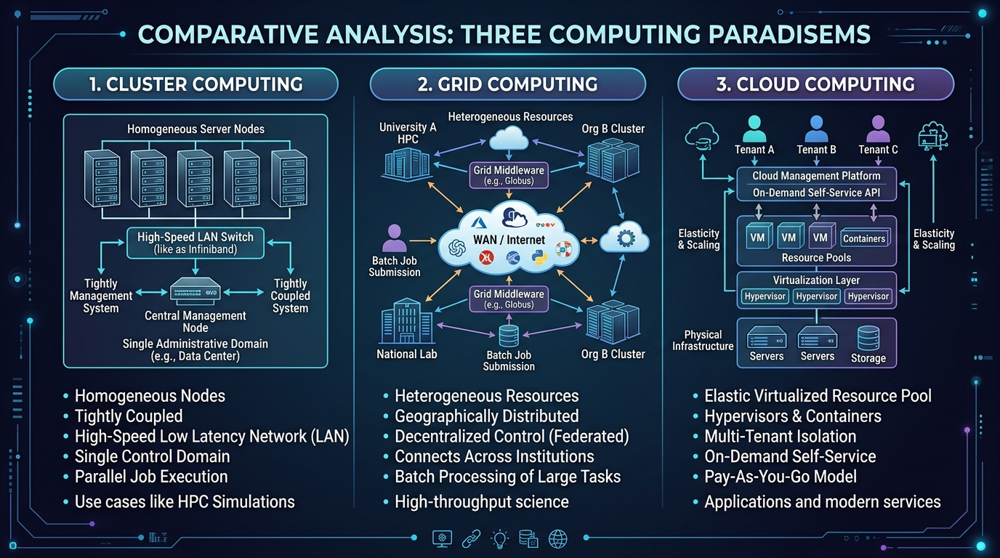
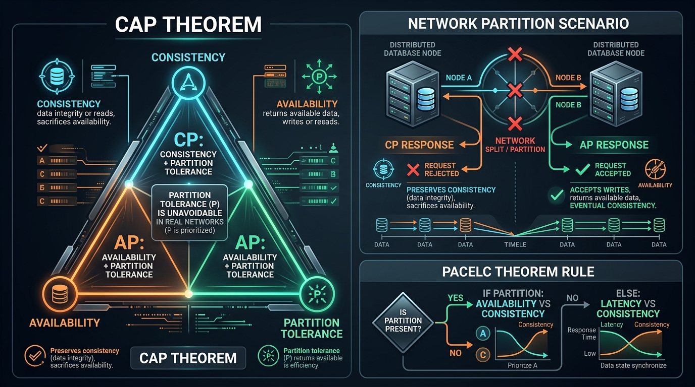

# Pertemuan 02: Evolusi Teknologi — Dari Sistem Terdistribusi ke Komputasi Awan

**Mata Kuliah:** Komputasi Awan (*Cloud Computing*)  
**Kode MK / Bobot:** TI433946 / 3 SKS  
**Sub-CPMK:** Mahasiswa mampu menguasai dan memahami Dasar Komputasi Awan, Infrastruktur, & Teknologi Pendukung Cloud (Sub-CPMK 1 & 3).

---

## 1. Tujuan Pembelajaran
Setelah menyelesaikan materi pada pertemuan ini, mahasiswa diharapkan mampu:
1. Memetakan kronologi evolusi arsitektur komputasi dari era *Mainframe* hingga *Cloud Computing*.
2. Memahami konsep fundamental sistem terdistribusi (*distributed systems*) yang mendasari komputasi awan.
3. Menganalisis implikasi **Teorema CAP** (*Consistency, Availability, Partition Tolerance*) dan **PACELC** terhadap arsitektur penyimpanan cloud modern.
4. Menjelaskan perbedaan arsitektural antara *Cluster Computing*, *Grid Computing*, dan *Cloud Computing*.

---

## 2. Kronologi Evolusi Komputasi

Komputasi awan bukanlah teknologi yang muncul secara tiba-tiba, melainkan hasil kulminasi dan evolusi bertahap selama lebih dari lima dekade dalam disiplin ilmu sistem terdistribusi.

```
+-------------------------------------------------------------------------+
|                  GARIS WAKTU EVOLUSI KOMPUTASI AWAN                     |
+-------------------------------------------------------------------------+
| 1960-an  | Mainframe & Time-Sharing (Satu komputer besar, banyak dumb   |
|          | terminal; konsep awal John McCarthy: komputasi jadi utilitas)|
| 1980-an  | Client-Server Architecture (PC terdistribusi, database pusat)|
| 1990-an  | Cluster Computing (Kumpulan komputer komoditas dalam 1 LAN)  |
| 2000-an  | Grid Computing (Federasi komputasi skala luas geografis)     |
| 2006-an  | Cloud Computing (Virtualisasi + Automasi API + Skalabilitas) |
+-------------------------------------------------------------------------+
```


*Gambar 2.1: Diagram Garis Waktu dan Tahapan Evolusi Arsitektur Komputasi: Dari Era Mainframe, Client-Server, Cluster, Grid, hingga Cloud Computing Modern.*

### 2.1 Mainframe dan Time-Sharing (1960–1970-an)
- **Karakteristik:** Komputer berukuran besar dan sangat mahal (misal: IBM System/360) yang memproses data terpusat.
- **Inovasi Penting:** Ditemukannya konsep *Time-Sharing*, di mana sistem operasi membagi waktu siklus CPU ke ratusan terminal pengguna secara bergantian (konkuren), menciptakan ilusi bahwa setiap pengguna memiliki komputer sendiri.
- **Prediksi Futuristik:** Pada tahun 1961, ilmuwan komputer MIT John McCarthy menyatakan: *"Komputasi suatu saat nanti mungkin akan diorganisir sebagai utilitas publik, sama seperti sistem telepon atau listrik."*

### 2.2 Arsitektur Client-Server (1980–1990-an)
- Munculnya komputer mikro (*Personal Computer / PC*) mengubah pola komputasi.
- Komputasi didesentralisasi: Komputer klien bertugas memproses antarmuka pengguna (*User Interface* dan logika lokal), sedangkan server bertugas memusatkan penyimpanan basis data dan transaksi berkas.

### 2.3 Cluster Computing (1990-an)
- **Konsep:** Menggabungkan sekumpulan komputer komoditas (*Off-The-Shelf hardware*) yang saling terhubung melalui jaringan lokal (*LAN berkecepatan tinggi*) untuk bekerja bersama sebagai satu sistem komputasi terpadu (dikenal dengan arsitektur *Beowulf Cluster*).
- **Ciri Khas:** Node biasanya homogen, berada dalam satu ruangan/data center yang sama, dan dikelola oleh satu entitas administratif tunggal.

### 2.4 Grid Computing (Akhir 1990-an – Awal 2000-an)
- **Konsep:** Mengintegrasikan dan mengoordinasikan sumber daya komputasi yang heterogen secara geografis dari berbagai institusi otonom untuk menyelesaikan masalah komputasi ilmiah skala masif (*Grand Challenge Problems*).
- **Contoh Nyata:** Proyek *SETI@home* (pencarian sinyal radio luar angkasa) dan komputasi simulasi partikel di *CERN Large Hadron Collider (LHC)*.
- **Kelemahan Grid:** Sangat kaku, protokol akses rumit, sulit menjamin ketersediaan interaktif secara *real-time*, dan tidak mendukung isolasi multi-tenant yang fleksibel.

### 2.5 Kelahiran Komputasi Awan (Pertengahan 2000-an)
Komputasi Awan menyempurnakan kelemahan Grid Computing dengan mengawinkan:
1. **Virtualisasi Modern:** Memungkinkan abstraksi dan partisi perangkat keras secara cepat.
2. **Penyediaan Berbasis API (*API-driven Provisioning*):** Mesin dapat dipesan dan dimatikan lewat perintah kode.
3. **Internet Broadband Kecepatan Tinggi:** Menghilangkan batasan jarak antara pengguna dan data center.

---

## 3. Komparasi: Cluster vs Grid vs Cloud Computing

| Aspek | Cluster Computing | Grid Computing | Cloud Computing |
| :--- | :--- | :--- | :--- |
| **Lokasi Fisik** | Terlokalisasi (Satu ruangan data center/LAN). | Tersebar luas secara geografis (WAN/Internet). | Tersebar di *Regions* & *Availability Zones* global. |
| **Homogenitas Node** | Homogen (Hardware & OS serupa). | Heterogen (Bisa beragam OS & arsitektur CPU). | Terabstraksi (Menggunakan mesin virtual / container). |
| **Model Akses** | Antrean komputasi batch (Job queue). | Antrean batch via middleware khusus (Globus). | On-demand self-service via Web UI, CLI, REST API. |
| **Isolasi Beban Kerja** | Terbatas (Berbagi sistem operasi). | Tingkat proses (Process-level scheduling). | Kuat (Isolasi via Hypervisor & Kernel Namespaces). |
| **Model Bisnis** | Kepemilikan aset internal (*CAPEX*). | Kolaborasi riset akademis / konsorsium. | Bayar sesuai pemakaian (*Pay-as-you-go, OPEX*). |


*Gambar 2.2: Komparasi Topologi Arsitektural, Batasan Administratif, dan Mekanisme Abstraksi Sumber Daya: Cluster Computing vs Grid Computing vs Cloud Computing.*

---

## 4. Teorema Fundamental Sistem Terdistribusi

Setiap arsitek komputasi awan wajib memahami keterbatasan teoritis yang mengatur sistem terdistribusi:

### 4.1 Teorema CAP (*Brewer's Theorem*)
Diformulasikan oleh Eric Brewer pada tahun 2000, Teorema CAP menyatakan bahwa dalam sebuah sistem data terdistribusi yang terhubung melalui jaringan, **hanya dua dari tiga jaminan berikut yang dapat dicapai secara bersamaan**:

```
                  Consistency (C)
                       / \
                      /   \
                     /  CA \
                    /   *   \
      Availability (A)-------Partition Tolerance (P)
              \                 /
               \--- CP / AP ---/
```


*Gambar 2.3: Teorema CAP (Brewer's Theorem), Skenario Pemisahan Jaringan (Network Partition / Split-Brain Trade-off), dan Formulasi Teorema PACELC.*

1. **Consistency (C):** Setiap operasi pembacaan data (*read*) selalu menerima data penulisan terakhir (*latest write*) atau menghasilkan pesan kesalahan (*error*). Semua node melihat data yang identik pada waktu yang sama.
2. **Availability (A):** Setiap permintaan (*request*) yang tidak gagal selalu menerima respons (bukan pesan kesalahan/timeout), meskipun tidak ada jaminan bahwa data tersebut adalah yang paling mutakhir.
3. **Partition Tolerance (P):** Sistem tetap dapat beroperasi meskipun terjadi kegagalan jaringan (*network split/partition*) di mana komunikasi antar node terputus atau terhambat.

> **Hukum Alam Jaringan:** Karena jaringan fisik di dunia nyata pasti akan mengalami gangguan (*network partition* tidak dapat dihindari, $P$ adalah kewajiban), maka sistem terdistribusi hanya dapat memilih salah satu di antara:
> - **CP (Consistency + Partition Tolerance):** Jika terjadi pemisahan jaringan, tolak permintaan baca/tulis demi menjaga keabsahan data agar tidak terjadi inkonsistensi (misal: Sistem Transaksi Perbankan, Apache HBase, ZooKeeper).
> - **AP (Availability + Partition Tolerance):** Jika terjadi pemisahan jaringan, tetap layani permintaan meskipun data yang disajikan mungkin data usang (misal: Feed Media Sosial, DNS, Amazon DynamoDB, Apache Cassandra).

### 4.2 Model Konsistensi ACID vs BASE
- **ACID (Sistem Monolitik Tradisional):** *Atomicity, Consistency, Isolation, Durability*. Mengutamakan konsistensi mutlak seketika, namun sulit diskalakan secara horizontal lintas wilayah global.
- **BASE (Sistem Cloud Modern):**
  - **Basically Available:** Ketersediaan dasar dijamin melalui redundansi.
  - **Soft-state:** Status data dapat berubah seiring waktu meskipun tanpa input baru (karena proses sinkronisasi background).
  - **Eventual Consistency:** Jika tidak ada pembaruan baru, seluruh replika akhirnya (*eventually*) akan menjadi konsisten dan sama.

---

## 5. Teorema PACELC
Perluasan dari Teorema CAP oleh Daniel Abadi:
- **IF Partition (P):** Bagaimana sistem memilih antara **Availability (A)** vs **Consistency (C)**?
- **ELSE (E):** Saat jaringan normal (tidak ada partisi), bagaimana sistem memilih antara **Latency (L)** vs **Consistency (C)**?

Contoh: Amazon DynamoDB dirancang dengan prinsip **PA/EL**: Mengorbankan konsistensi seketika saat ada partisi demi ketersediaan (PA), dan saat jaringan normal memilih latensi sangat rendah dengan mengandalkan *Eventual Consistency* (EL).

---

## 6. Latihan Analisis Kasus (Higher-Order Thinking)

### Skenario:
Sebuah perusahaan aplikasi e-commerce sedang merancang dua layanan mikro (*microservices*):
1. **Layanan Keranjang Belanja & Riwayat Produk Dilihat**
2. **Layanan Pembayaran & Pemotongan Saldo Dompet Digital**

### Instruksi Tugas Mandiri:
1. Berdasarkan Teorema CAP, tentukan kombinasi mana yang paling tepat untuk masing-masing layanan di atas (apakah **AP** atau **CP**)? Jelaskan dasar alasannya!
2. Apa dampak bisnis jika layanan pemotongan saldo dompet digital dirancang menggunakan model *Eventual Consistency*?
3. Mengapa sistem terdistribusi skala cloud modern lebih memilih model konsistensi *BASE* dibandingkan *ACID* untuk fitur-fitur interaktif pengguna?
