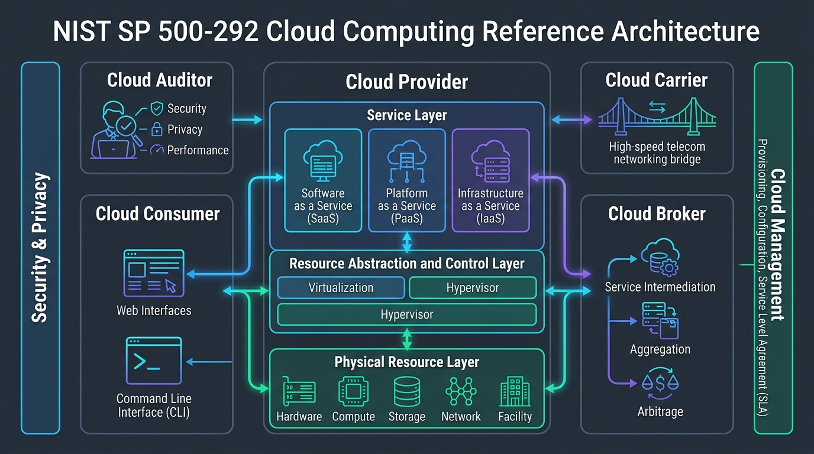
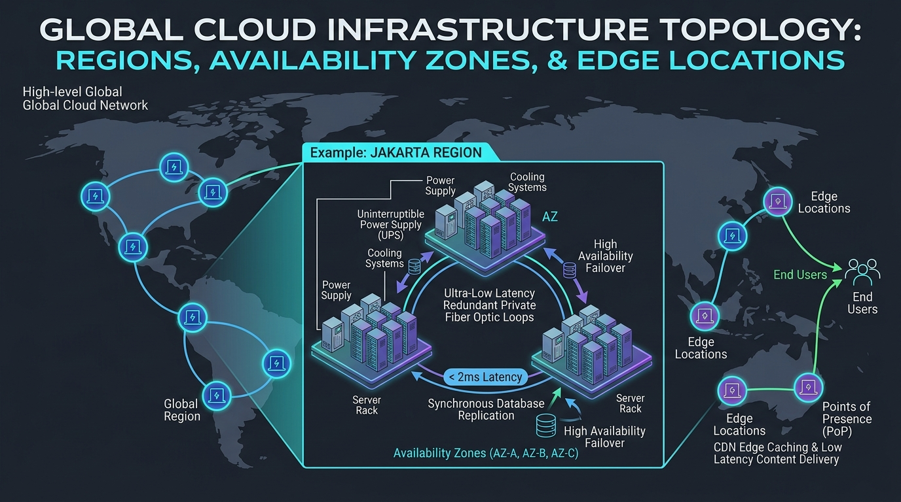

# Pertemuan 03: Arsitektur Komputasi Awan

**Mata Kuliah:** Komputasi Awan (*Cloud Computing*)  
**Kode MK / Bobot:** TI433946 / 3 SKS  
**Sub-CPMK:** Mahasiswa mampu menguasai dan memahami Dasar Komputasi Awan, Infrastruktur, & Teknologi Pendukung Cloud (Sub-CPMK 1 & 3).

---

## 1. Tujuan Pembelajaran
Setelah menyelesaikan materi pada pertemuan ini, mahasiswa diharapkan mampu:
1. Menguraikan arsitektur referensi komputasi awan berdasarkan standar NIST SP 500-292.
2. Membedakan komponen dan alur komunikasi antara arsitektur *Front-End* dan *Back-End* pada cloud provider.
3. Menganalisis konsep *Multi-Tenancy*, strategi isolasi sumber daya, serta penanganan masalah *Noisy Neighbor*.
4. Merancang topologi ketersediaan tinggi (*High Availability*) dengan memanfaatkan konsep *Regions*, *Availability Zones*, dan *Edge Locations*.

---

## 2. Arsitektur Referensi Komputasi Awan (NIST SP 500-292)

NIST mendefinisikan 5 aktor utama dalam ekosistem komputasi awan:



```
+-----------------------------------------------------------------------+
|                 NIST CLOUD REFERENCE ARCHITECTURE                     |
+-----------------------------------------------------------------------+
|  +----------------+   +---------------+   +------------------------+  |
|  | Cloud Consumer |<->| Cloud Broker  |<->|     Cloud Provider     |  |
|  +----------------+   +---------------+   +------------------------+  |
|          ^                                             ^              |
|          |            +---------------+                |              |
|          +----------->| Cloud Auditor |<---------------+              |
|                       +---------------+                               |
|                                                                       |
|  +-----------------------------------------------------------------+  |
|  |                   Cloud Carrier (Jaringan/Telko)                |  |
|  +-----------------------------------------------------------------+  |
+-----------------------------------------------------------------------+
```

1. **Cloud Consumer:** Individu atau organisasi yang menggunakan layanan komputasi awan.
2. **Cloud Provider:** Entitas penyedia layanan komputasi awan (misal: AWS, Google Cloud, Microsoft Azure, Alibaba Cloud).
3. **Cloud Auditor:** Pihak independen yang menguji dan memverifikasi kepatuhan, keamanan, serta kinerja operasional cloud.
4. **Cloud Broker:** Perantara yang mengelola performa, agregasi, dan penyesuaian layanan dari beberapa penyedia cloud untuk konsumen.
5. **Cloud Carrier:** Penyedia jaringan telekomunikasi yang menghubungkan konsumen dengan infrastruktur cloud provider.

---

## 3. Arsitektur Front-End dan Back-End

Arsitektur komputasi awan terbelah menjadi dua domain fungsional besar:

```
                     +---------------------------+
                     |    FRONT-END DOMAIN       |
                     |  (Pengguna, Browser, CLI) |
                     +-------------+-------------+
                                   | (HTTPS / REST API)
                     +-------------v-------------+
                     |        API GATEWAY        |
                     | (Authn, Authz, Throttling)|
                     +-------------+-------------+
                                   |
    +------------------------------+-------------------------------+
    |                      BACK-END DOMAIN                         |
    |  +---------------------+  +-------------------------------+  |
    |  |  Cloud Controller   |  |   Resource Orchestration      |  |
    |  +----------+----------+  +---------------+---------------+  |
    |             |                             |                  |
    |  +----------v----------+  +---------------v---------------+  |
    |  |  Hypervisor / VMs   |  | Storage Clusters (S3/Ceph)   |  |
    |  +---------------------+  +-------------------------------+  |
    |  |  Hardware Servers   |  | Software-Defined Network (SDN)|  |
    |  +---------------------+  +-------------------------------+  |
    +--------------------------------------------------------------+
```

### 3.1 Front-End (Sisi Konsumen)
- **Komponen:** Antarmuka Pengguna Grafis (*Management Console*), *Command-Line Interface* (CLI), *Software Development Kits* (SDKs).
- **Fungsi:** Mengirimkan instruksi pemesanan, modifikasi, dan pemantauan infrastruktur ke sisi penyedia melalui protokol aman (HTTPS) berbasis arsitektur RESTful atau gRPC.

### 3.2 Back-End (Sisi Penyedia Layanan)
- **API Gateway & Identity Service:** Memverifikasi tanda tangan digital pemanggil API, hak akses (RBAC), dan pembatasan laju (*rate limiting*).
- **Cloud Controller (Orchestrator):** Otak pusat penyedia (misal: Nova pada OpenStack, Borg pada Google, Nitro pada AWS). Bertugas mencari node fisik yang memiliki kapasitas kosong untuk meluncurkan VM/container baru.
- **Storage Subsystem:** Sistem file terdistribusi skala petabyte (misal: Ceph, AWS S3/EBS).
- **Network Fabric (SDN):** Melakukan isolasi paket data menggunakan tunneling virtual (VXLAN / Geneve).

---

## 4. Konsep Multi-Tenancy dan Penanganan *Noisy Neighbor*

### 4.1 Apa itu Multi-Tenancy?
*Multi-tenancy* adalah prinsip arsitektur perangkat lunak dan infrastruktur di mana **satu instans lingkungan komputasi fisik melayani banyak konsumen (*tenants*) secara bersamaan**, dengan jaminan isolasi logis yang ketat.

| Pendekatan | Deskripsi | Kelebihan | Kekurangan |
| :--- | :--- | :--- | :--- |
| **Single-Tenant** | Setiap pelanggan memiliki server fisik (*Dedicated Bare-Metal*) sendiri. | Isolasi sempurna, kepatuhan mudah. | Biaya sangat mahal, efisiensi resource rendah. |
| **Multi-Tenant** | Banyak pelanggan berbagi CPU, RAM, dan disk fisik yang sama. | Biaya sangat terjangkau, utilisasi resource optimal. | Membutuhkan keamanan isolasi ekstra. |

### 4.2 Masalah *Noisy Neighbor* (*Tetangga Berisik*)
- **Definisi:** Kondisi di mana satu pengguna (*tenant A*) pada server fisik yang sama mengonsumsi resource secara berlebihan (misal: I/O disk atau bandwidth jaringan yang intensif), sehingga menurunkan performa pengguna lain (*tenant B*) yang tidak bersalah.
- **Mekanisme Solusi Teknis:**
  1. **CPU & Memory Pinning:** Hypervisor mengunci core vCPU spesifik ke pCPU fisik.
  2. **cgroups (Control Groups):** Pembatasan kuota I/O per detik (IOPS limiter) dan bandwidth throttling.
  3. **Dedicated Instances:** Opsi cloud di mana pelanggan membayar lebih untuk memesan satu server fisik penuh tanpa tenant lain.

---

## 5. Topologi Fisik Cloud: Regions, Availability Zones, dan Edge

Penyedia cloud global mendistribusikan infrastruktur fisik mereka dengan hierarki terstruktur:



```
[ GLOBAL CLOUD INFRASTRUCTURE ]
   |
   +---> Region (Wilayah Geografis Mandiri, mis: Jakarta / ap-southeast-3)
          |
          +---> Availability Zone A (Data Center Fisik 1, Cikarang)
          |        |--> Server Racks, Genset Mandiri, UPS Mandiri
          |
          +---> Availability Zone B (Data Center Fisik 2, Karawang)
          |        |--> Terhubung fiber optik privat latensi ultra rendah (< 2ms)
          |
          +---> Availability Zone C (Data Center Fisik 3, Serpong)

   +---> Edge Locations / PoP (Ratusan titik cache CDN terdistribusi di kota-kota besar)
```

1. **Region:** Area geografis terpisah di dunia (misal: *Jakarta ap-southeast-3*, *Singapore ap-southeast-1*). Setiap region sepenuhnya terisolasi dari region lain untuk membatasi dampak kegagalan global.
2. **Availability Zone (AZ):** Satu atau sekumpulan pusat data fisik diskrit di dalam satu Region yang memiliki pasokan listrik, pendingin, dan keamanan fisik mandiri. Jarak antar AZ dirancang cukup jauh agar tidak terkena dampak bencana lokal yang sama (banjir/gempa), namun cukup dekat sehingga terhubung kabel fiber optik berkecepatan tinggi dengan latensi RTT (*Round-Trip Time*) di bawah 1–2 milidetik.
3. **Edge Locations (Points of Presence / PoP):** Pusat data mini yang ditempatkan di kota-kota padat pengguna untuk menjalankan layanan *Content Delivery Network* (CDN) dan proteksi DDoS (misal: Cloudflare, AWS CloudFront).

---

## 6. Latihan Desain Arsitektur (Tugas Kelompok)

### Kasus:
Sistem Perbankan Digital Nasional mewajibkan tingkat ketersediaan (*uptime*) minimal **99.99%** dan data transaksi tidak boleh hilang (*Zero Data Loss / RPO = 0*) meskipun satu pusat data fisik terbakar atau kebanjiran.

### Tugas Desain:
1. Gambarkan sketsa arsitektur penempatan server aplikasi (*Web/App*) dan basis data (*Database*) menggunakan konsep **Multi-AZ Deployment**!
2. Jelaskan bagaimana mekanisme *Synchronous Replication* antara AZ A dan AZ B memastikan ketiadaan kehilangan data saat bencana terjadi pada salah satu AZ!
3. Kapan sebuah organisasi perlu menerapkan **Multi-Region Deployment**, dan apa kompromi latensi yang harus dibayar?
