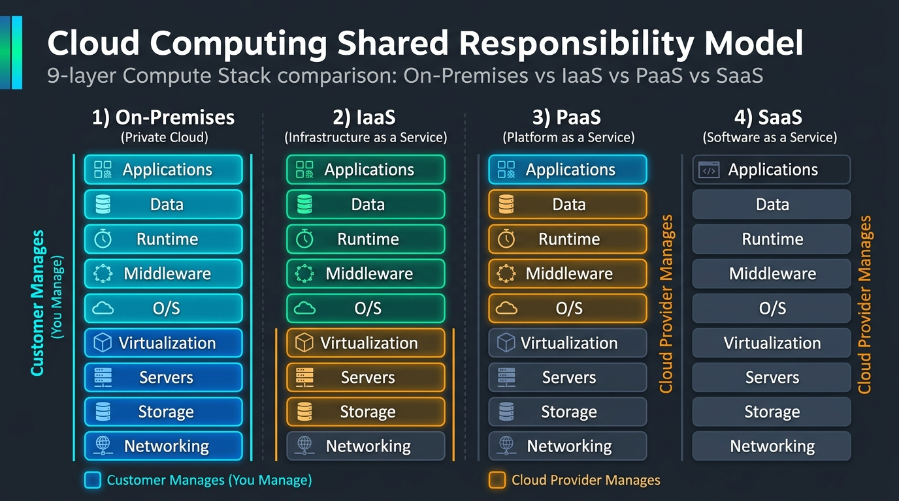
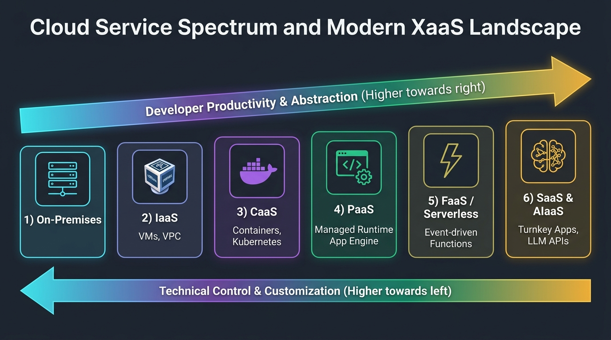

# Pertemuan 04: Model Layanan Komputasi Awan (SPI & XaaS)

**Mata Kuliah:** Komputasi Awan (*Cloud Computing*)  
**Kode MK / Bobot:** TI433946 / 3 SKS  
**Sub-CPMK:** Mahasiswa mampu menguasai dan memahami Dasar Komputasi Awan, Infrastruktur, & Teknologi Pendukung Cloud (Sub-CPMK 1 & 3).

---

## 1. Tujuan Pembelajaran
Setelah menyelesaikan materi pada pertemuan ini, mahasiswa diharapkan mampu:
1. Menganalisis secara presisi batas tanggung jawab pengelolaan (*Responsibility Boundary*) pada model layanan SPI (IaaS, PaaS, SaaS).
2. Menjelaskan analogi dekonstruksi stack komputasi 9 lapis (*Compute Stack*).
3. Mengidentifikasi ragam model layanan modern XaaS (*Everything as a Service*), seperti CaaS, DBaaS, FaaS, dan AIaaS.
4. Menentukan model layanan yang paling optimal berdasarkan kriteria fleksibilitas, kontrol teknis, keahlian tim, dan efisiensi biaya.

---

## 2. Model Klasik SPI (SaaS, PaaS, IaaS)

Industri komputasi awan membagi hierarki layanan menjadi tiga tingkatan abstraksi utama yang dikenal dengan akronim **SPI Model**:

```
+---------------------------------------------------------------------+
|                      HIERARKI MODEL LAYANAN CLOUD                   |
+---------------------------------------------------------------------+
| [ Tinggi ]  SaaS (Software as a Service)  - End-User Focus          |
|      ^      PaaS (Platform as a Service)  - Developer Focus         |
|      |      IaaS (Infrastructure as a Service) - SysAdmin Focus     |
| [ Rendah ]  On-Premise (Private Data Center) - Full Hardware Control|
+---------------------------------------------------------------------+
  Abstraksi & Kemudahan Operasional  <=======>  Kontrol & Fleksibilitas
```

---

## 3. Dekonstruksi 9 Lapis Stack Komputasi

Untuk memahami di mana letak batas tanggung jawab antara **Pengguna (*You Manage*)** dan **Penyedia Cloud (*Vendor Manages*)**, perhatikan dekonstruksi 9 lapis berikut:



| Lapisan Komputasi (*Stack Layer*) | On-Premise | IaaS | PaaS | SaaS |
| :--- | :---: | :---: | :---: | :---: |
| **9. Applications (Aplikasi)** | Konsumen | **Konsumen** | **Konsumen** | Penyedia |
| **8. Data (Basis Data & Konten)** | Konsumen | **Konsumen** | **Konsumen** | Penyedia |
| **7. Runtime (Java, Node.js, Python)** | Konsumen | **Konsumen** | Penyedia | Penyedia |
| **6. Middleware (Web Server, Queue)**| Konsumen | **Konsumen** | Penyedia | Penyedia |
| **5. Operating System (OS/Kernel)** | Konsumen | **Konsumen** | Penyedia | Penyedia |
| **4. Virtualization (Hypervisor)** | Konsumen | Penyedia | Penyedia | Penyedia |
| **3. Servers (Perangkat Fisik CPU/RAM)** | Konsumen | Penyedia | Penyedia | Penyedia |
| **2. Storage (Harddisk/SSD Fisik)** | Konsumen | Penyedia | Penyedia | Penyedia |
| **1. Networking (Kabel, Switch, Router)** | Konsumen | Penyedia | Penyedia | Penyedia |

### Analogi Populer: *"Pizza as a Service"*
- **On-Premise (Makan di Rumah dari Nol):** Anda membeli gandum, membuat adonan, memanaskan oven, menyajikan di meja Anda sendiri, dan mencuci piringnya.
- **IaaS (Beli Pizza Beku / *Take & Bake*):** Toko menyediakan pizza setengah jadi. Anda membawa pulang, memanggang di oven Anda, dan mengatur meja makan Anda.
- **PaaS (Pesan Antar Pizza / *Delivery*):** Restoran memanggang dan mengantar pizza ke rumah Anda. Anda hanya perlu menyediakan meja makan dan minuman.
- **SaaS (Makan di Restoran Pizza / *Dine Out*):** Restoran menyiapkan semuanya dari adonan, oven, tempat duduk, hingga pelayan yang membersihkan meja. Anda tinggal duduk dan makan.

---

## 4. Karakteristik Mendalam Masing-Masing Model

### 4.1 Infrastructure as a Service (IaaS)
- **Definisi:** Penyedia menyediakan blok bangunan komputasi dasar mentah: mesin virtual (*Virtual Machines*), alokasi penyimpanan blok, alamat IP publik, dan jaringan virtual (*VPC*).
- **Karakteristik Kunci:**
  - Pengguna memiliki akses level *root* / *Administrator* ke OS.
  - Pengguna bertanggung jawab penuh atas *patching* keamanan OS, konfigurasi firewall, dan instalasi runtime.
- **Contoh Nyata:** AWS EC2, Google Compute Engine, Microsoft Azure Virtual Machines, DigitalOcean Droplets.
- **Kapan Digunakan?** Ketika aplikasi membutuhkan modul kernel khusus, migrasi sistem *legacy* tanpa refaktor kode, atau memerlukan kendali mendalam atas arsitektur jaringan.

### 4.2 Platform as a Service (PaaS)
- **Definisi:** Lingkungan siap pakai yang mengabstraksi sistem operasi dan perangkat keras. Pengembang cukup mengunggah kode sumber (*source code*) atau berkas biner, dan platform akan menangani kompilasi, penyediaan server web, penskalaan, dan *load balancing*.
- **Karakteristik Kunci:**
  - Tidak ada akses ke OS atau kernel langsung.
  - Siklus rilis aplikasi sangat cepat (*continuous deployment*).
- **Contoh Nyata:** Heroku, AWS Elastic Beanstalk, Google App Engine, Firebase App Hosting.
- **Kapan Digunakan?** Ketika tim pengembang ingin fokus 100% pada penulisan logika bisnis tanpa dibebani urusan administrasi sistem (*SysAdmin*).

### 4.3 Software as a Service (SaaS)
- **Definisi:** Aplikasi perangkat lunak lengkap yang dapat langsung dikonsumsi oleh pengguna akhir melalui peramban web atau aplikasi seluler.
- **Karakteristik Kunci:**
  - Arsitektur berbasis langganan bulanan/tahunan (*subscription*).
  - Skalabilitas, backup data, dan pembaruan fitur ditangani sepihak oleh penyedia secara transparan.
- **Contoh Nyata:** Google Workspace (Gmail, Docs), Microsoft 365, Salesforce CRM, Zoom.
- **Kapan Digunakan?** Untuk kebutuhan aplikasi standar operasional organisasi sehari-hari yang tidak memerlukan pengembangan kustom dari awal.

---

## 5. Lanskap XaaS Modern (*Everything as a Service*)

Perkembangan teknologi melahirkan sub-kategori layanan spesifik:

1. **CaaS (*Containers as a Service*):** Layanan orkestrasi container terkelola di mana kontrol panel dikelola penyedia (misal: Google Kubernetes Engine / GKE, Amazon EKS).
2. **DBaaS (*Database as a Service*):** Basis data relasional atau NoSQL terkelola dengan fitur otomatisasi *failover*, replikasi, dan *backup* (misal: Amazon RDS, MongoDB Atlas, Cloud Spanner).
3. **FaaS (*Function as a Service / Serverless*):** Pengguna hanya mengunggah satu blok fungsi kode kecil yang dieksekusi hanya saat ada pemicu (*event trigger*) (misal: AWS Lambda, Google Cloud Functions).
4. **AIaaS (*AI as a Service*):** Akses API langsung ke model kecerdasan buatan dan *Large Language Models* (misal: OpenAI API, Google Vertex AI, AWS Bedrock).

---

## 6. Matriks Pemilihan Model Layanan



```
                 KONTROL TEKNIS (FLEKSIBILITAS)
                 Rendah <-------------------------> Tinggi
BIAYA OPERASIONAL   SaaS  ----->  PaaS  ----->  IaaS  -----> On-Premise
PEMELIHARAAN     (Terkecil)                          (Terbesar)
```

### Panduan Pengambilan Keputusan:
- **Pilih SaaS jika:** Tersedia produk perangkat lunak standar di pasar yang sudah 90% memenuhi kebutuhan bisnis Anda.
- **Pilih PaaS jika:** Anda membangun aplikasi baru berbasis web/API, tim Anda mayoritas programmer tanpa teknisi infrastruktur, dan ingin meluncurkan MVP (*Minimum Viable Product*) secepat mungkin.
- **Pilih IaaS jika:** Anda memerlukan kontrol performa perangkat keras, konfigurasi sistem operasi tingkat rendah, atau menjalankan perangkat lunak khusus yang tidak didukung PaaS.

---

## 7. Tugas Analisis Kasus (Case Study)

### Skenario:
Sebuah klinik kesehatan rintisan (*startup Telemedicine*) memiliki 3 pengembang perangkat lunak dan 1 desainer produk. Mereka sedang merancang sistem yang terdiri dari:
1. Layanan email dan kolaborasi dokumen tim internal.
2. Aplikasi mobile pasien untuk konsultasi dokter (backend API).
3. Modul analitik citra rontgen menggunakan deep learning dengan pustaka CUDA khusus.

### Instruksi:
Untuk masing-masing dari ketiga kebutuhan sistem di atas, tentukan model layanan mana yang paling tepat (**SaaS, PaaS, IaaS, atau XaaS**). Berikan argumentasi teknis dan pertimbangan efisiensi anggarannya!
