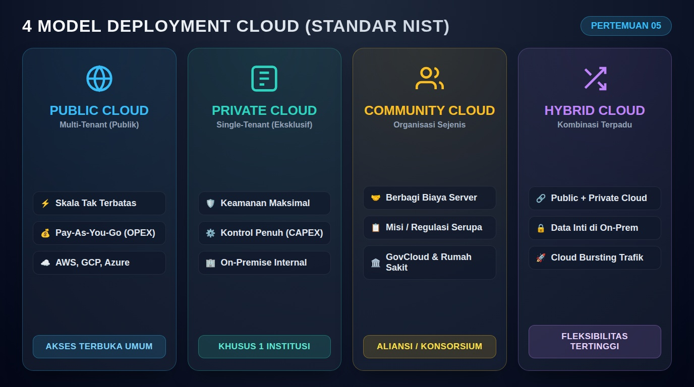
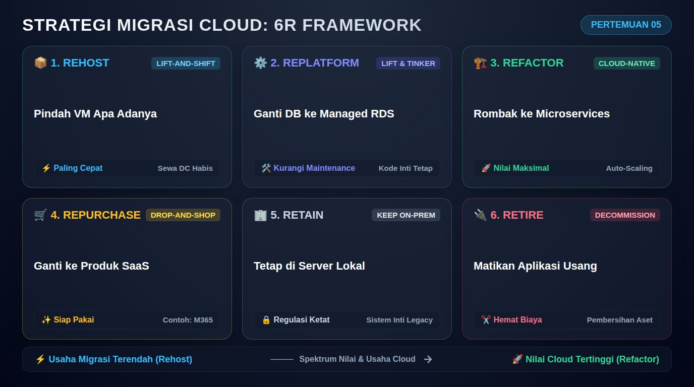

# Pertemuan 05: Model Deployment dan Strategi Migrasi Cloud

**Mata Kuliah:** Komputasi Awan (*Cloud Computing*)  
**Kode MK / Bobot:** TI433946 / 3 SKS  
**Sub-CPMK:** Mahasiswa mampu menguasai dan memahami Dasar Komputasi Awan, Infrastruktur, & Teknologi Pendukung Cloud (Sub-CPMK 1 & 3).

---

## 1. Tujuan Pembelajaran
Setelah menyelesaikan materi pada pertemuan ini, mahasiswa diharapkan mampu:
1. Membandingkan secara kritis 4 model deployment cloud (*Public, Private, Hybrid, Community Cloud*).
2. Merancang pola konektivitas aman pada arsitektur *Hybrid Cloud* (VPN vs Direct Connect).
3. Menganalisis kerangka kerja migrasi **6R** (*Rehost, Replatform, Refactor, Repurchase, Retain, Retire*).
4. Menyelesaikan studi kasus pemilihan arsitektur deployment pada sektor perbankan dan e-commerce.

---

## 2. Empat Model Deployment Cloud (NIST Standard)

Model deployment menentukan **siapa yang memiliki, mengoperasikan, dan di mana infrastruktur fisik komputasi awan ditempatkan**.



```
+--------------------------------------------------------------------------+
|                        4 MODEL DEPLOYMENT CLOUD                          |
+--------------------------------------------------------------------------+
|  1. Public Cloud     --> Infrastruktur terbuka untuk masyarakat umum     |
|  2. Private Cloud    --> Didedikasikan eksklusif untuk satu organisasi   |
|  3. Community Cloud  --> Berbagi antar beberapa institusi sejenis        |
|  4. Hybrid Cloud     --> Kombinasi terintegrasi antara Public & Private  |
+--------------------------------------------------------------------------+
```

### 2.1 Public Cloud (Awan Publik)
- **Definisi:** Infrastruktur dimiliki dan dioperasikan oleh pihak ketiga (*cloud provider*) dan sumber daya komputasinya disewakan kepada publik umum melalui internet menggunakan model *multi-tenant*.
- **Kelebihan:** Skalabilitas hampir tak terbatas, tanpa investasi awal perangkat keras, pemeliharaan fisik ditanggung vendor.
- **Tantangan:** Kurangnya kontrol atas lokasi fisik hardware, kepatuhan regulasi data yang ketat.
- **Penyedia:** AWS, Google Cloud, Microsoft Azure, Alibaba Cloud.

### 2.2 Private Cloud (Awan Privat)
- **Definisi:** Infrastruktur komputasi awan yang dioperasikan semata-mata untuk satu organisasi tunggal (*single-tenant*). Dapat dikelola secara mandiri di data center internal (*On-Premise Private Cloud*) atau disewa melalui pihak ketiga (*Hosted Private Cloud*).
- **Kelebihan:** Kontrol keamanan dan privasi maksimal, kustomisasi arsitektur bebas, mematuhi regulasi kedaulatan data.
- **Tantangan:** Membutuhkan investasi modal (*CAPEX*) tinggi dan tim teknisi berpengalaman untuk memelihara perangkat keras fisik.
- **Platform Pendukung:** OpenStack, Apache CloudStack, VMware vSphere, Proxmox VE.

### 2.3 Community Cloud (Awan Komunitas)
- **Definisi:** Infrastruktur cloud yang dibagi dan digunakan bersama secara eksklusif oleh beberapa organisasi yang memiliki kepentingan, misi, atau persyaratan kepatuhan regulasi yang sama.
- **Contoh Nyata:** *GovCloud* (layanan cloud khusus instansi pemerintahan dengan sertifikasi keamanan pertahanan), konsorsium jaringan rumah sakit, atau aliansi bank daerah.

### 2.4 Hybrid Cloud (Awan Hibrida)
- **Definisi:** Penggabungan dari dua atau lebih model deployment cloud yang berbeda (misalnya *Private Cloud* lokal digabungkan dengan *Public Cloud* AWS/GCP) yang tetap mempertahankan entitas unik masing-masing, namun dihubungkan oleh teknologi standarisasi yang memungkinkan portabilitas data dan aplikasi.

---

## 3. Pola Interkoneksi Hybrid Cloud

Agar *Private Cloud* lokal dapat berkomunikasi secara aman dengan *Public Cloud*, digunakan dua mekanisme interkoneksi utama:

```
[ Private Data Center Lokal ]                               [ Public Cloud VPC ]
+---------------------------+                               +------------------+
| Server Database On-Prem   |                               | Web Server App   |
+-------------+-------------+                               +--------+---------+
              |                                                      |
      [ Router / Gateway ]                                    [ Virtual Gateway]
              |                                                      |
              +=====> Opsi 1: IPsec VPN Tunnel (via Internet) ======>+
              |       (Biaya murah, latensi bervariasi, terenkripsi) |
              |                                                      |
              +=====> Opsi 2: Dedicated Direct Connect =============>+
                      (Kabel fisik privat leased-line, latensi ultra |
                       rendah, tanpa melewati internet publik)       |
```

1. **IPsec VPN (*Virtual Private Network*):**
   - Menghubungkan jaringan lokal ke cloud publik melalui terowongan terenkripsi di atas jaringan internet publik.
   - **Karakteristik:** Murah, setup cepat, namun *throughput* dan latensi sangat bergantung pada kestabilan penyedia jasa internet (ISP).
2. **Dedicated Interconnect (AWS Direct Connect / Azure ExpressRoute):**
   - Menghubungkan data center lokal secara langsung dengan router penyedia cloud menggunakan kabel fisik serat optik privat (*leased-line*).
   - **Karakteristik:** Sangat stabil, latensi terprediksi (< 5 ms), keamanan maksimal, biaya sewa sirkuit fisik relatif mahal.

### Konsep *Cloud Bursting*:
Pola arsitektur di mana aplikasi normal berjalan di *Private Cloud*. Namun ketika terjadi lonjakan beban di luar kapasitas server lokal, sistem secara otomatis melakukan "pecah beban" (*bursting*) dengan meminjam mesin virtual dari *Public Cloud* untuk melayani kelebihan trafik tersebut.

---

## 4. Strategi Migrasi Cloud: Kerangka Kerja 6R (Gartner / AWS)

Saat memindahkan sistem *On-Premise* ke Cloud, arsitek cloud menggunakan kerangka kerja 6R:



| Strategi | Nama Lain | Deskripsi & Contoh Kasus |
| :--- | :--- | :--- |
| **1. Rehost** | *Lift-and-Shift* | Memindahkan VM dan aplikasi apa adanya ke cloud tanpa mengubah kode. Cocok untuk migrasi cepat saat masa sewa data center habis. |
| **2. Replatform** | *Lift-Tinker-and-Shift* | Mengganti beberapa komponen dasar dengan layanan terkelola cloud tanpa mengubah kode inti (misal: memindahkan MySQL di VM ke Amazon RDS). |
| **3. Refactor** | *Re-architect* | Menulis ulang arsitektur aplikasi menjadi *Cloud-Native* (misal: mengubah monolitik menjadi microservices dan container). Memberikan manfaat cloud maksimal. |
| **4. Repurchase** | *Drop-and-Shop* | Menghentikan sistem lama dan menggantinya dengan produk SaaS siap pakai (misal: mengganti server email internal dengan Microsoft 365). |
| **5. Retain** | *Do Nothing* | Mempertahankan aplikasi di on-premise karena alasan regulasi, keterikatan hardware khusus, atau biaya migrasi belum ekonomis. |
| **6. Retire** | *Decommission* | Mematikan aplikasi yang sudah tidak lagi digunakan oleh organisasi setelah inventarisasi aset. |

---

## 5. Analisis Studi Kasus Nyata

### Kasus 1: Bank "Artha Aman" (Regulasi vs Fleksibilitas)
- **Masalah:** Regulasi Otoritas Jasa Keuangan (OJK) mewajibkan data saldo dan transaksi inti (*Core Banking*) nasabah harus berada di data center lokal di dalam negeri dengan tingkat kontrol keamanan tertinggi. Di sisi lain, aplikasi *Mobile Banking* nasabah membutuhkan pembaruan antarmuka cepat setiap minggu dan skalabilitas tinggi saat jam gajian.
- **Solusi Arsitektur:** **Hybrid Cloud**.
  - **Private Cloud:** Menyimpan basis data *Core Banking* dan modul transfer dana.
  - **Public Cloud:** Menjalankan antarmuka API mobile banking, analitik promosi, dan *Content Delivery Network* (CDN).
  - **Interkoneksi:** Menggunakan *Dedicated Direct Connect* terenkripsi untuk menghubungkan Public API ke Core Banking lokal.

### Kasus 2: E-Commerce "CepatBeli" (Lonjakan Trafik Flash Sale)
- **Masalah:** Server lokal sering mati (*down*) saat promo tanggal kembar (11.11).
- **Solusi Arsitektur:** **Public Cloud dengan strategi Refactor**. Mengonversi aplikasi web ke bentuk container Docker di orkestrator Kubernetes yang mendukung *Auto-Scaling* otomatis sesuai grafik trafik.

---

## 6. Latihan Mandiri Mahasiswa

Sebuah rumah sakit tipe A memiliki 3 sistem utama:
1. Rekam Medis Elektronik (RME) yang memuat riwayat resep dan penyakit pasien.
2. Portal Informasi Jadwal Dokter dan Pendaftaran Pasien Rawat Jalan berbasis web.
3. Sistem PACS (*Picture Archiving and Communication System*) untuk menyimpan ribuan berkas citra MRI dan CT-Scan ukuran raksasa.

**Tugas Anda sebagai Konsultan Cloud:**
1. Tentukan model deployment (*Public, Private, atau Hybrid*) yang paling tepat untuk rumah sakit tersebut!
2. Untuk masing-masing dari ketiga sistem di atas, tentukan strategi migrasi 6R yang paling logis dan hemat biaya!
