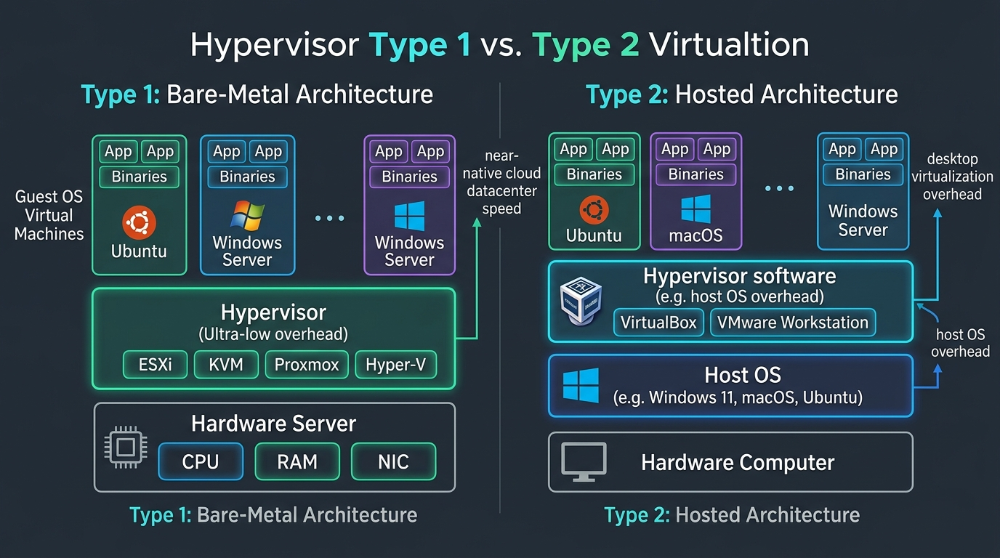
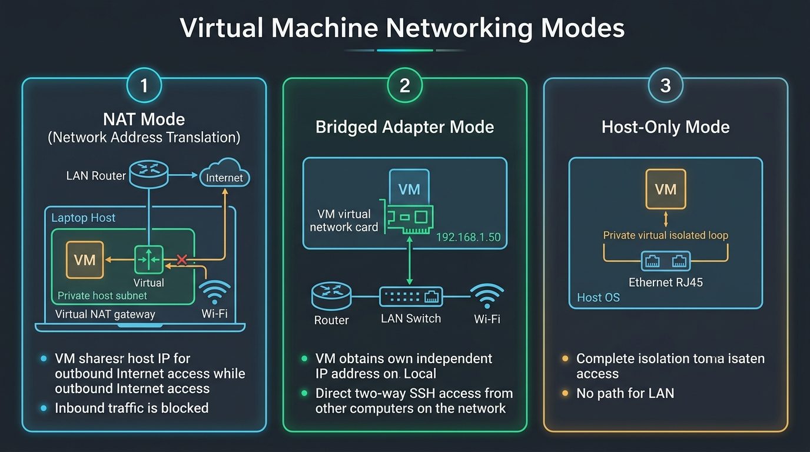

# Pertemuan 06: Teknologi Virtualisasi, Hypervisor, dan Praktikum VM

**Mata Kuliah:** Komputasi Awan (*Cloud Computing*)  
**Kode MK / Bobot:** TI433946 / 3 SKS  
**Sub-CPMK:** Mahasiswa mampu menguasai dan mempraktikkan Dasar Komputasi Awan, Infrastruktur, & Teknologi Pendukung Cloud (Sub-CPMK 1 & 3).

---

## 1. Tujuan Pembelajaran
Setelah menyelesaikan materi pada pertemuan ini, mahasiswa diharapkan mampu:
1. Menjelaskan prinsip dasar dan teorema virtualisasi perangkat keras (*Popek-Goldberg virtualization requirements*).
2. Membedakan secara komprehensif arsitektur **Hypervisor Tipe 1 (Bare-Metal)** dan **Hypervisor Tipe 2 (Hosted)**.
3. Menganalisis mekanisme virtualisasi CPU (*Hardware-assisted VT-x/AMD-V*), Memori (*EPT/SLAT*), dan I/O jaringan.
4. Mempraktikkan pembuatan, konfigurasi jaringan, dan manajemen mesin virtual (*Virtual Machine*) Linux Server secara mandiri.

---

## 2. Konsep Dasar Virtualisasi Perangkat Keras

Virtualisasi adalah teknik rekayasa perangkat lunak yang memungkinkan satu komputer fisik (*Host*) membagi sumber daya fisiknya (CPU, RAM, Disk, Jaringan) untuk menjalankan beberapa lingkungan sistem operasi (*Guest OS*) secara bersamaan dan terisolasi satu sama lain.



```
+------------------------------------+      +------------------------------------+
|       TIPE 1 (BARE-METAL)          |      |         TIPE 2 (HOSTED)            |
+------------------------------------+      +------------------------------------+
|  Guest OS 1   |  Guest OS 2        |      |  Guest OS 1   |  Guest OS 2        |
|  (Apps/Libs)  |  (Apps/Libs)       |      |  (Apps/Libs)  |  (Apps/Libs)       |
+---------------+--------------------+      +---------------+--------------------+
|   HYPERVISOR (ESXi / KVM / Proxmox)|      |   HYPERVISOR (VirtualBox / VMware) |
+------------------------------------+      +------------------------------------+
|       HARDWARE SERVER FISIK        |      |    HOST OPERATING SYSTEM (Win/Mac) |
|    (CPU, RAM, NIC, Storage)        |      +------------------------------------+
|                                    |      |       HARDWARE KOMPUTER FISIK      |
+------------------------------------+      +------------------------------------+
   Performa Tinggi, Latensi Rendah             Overhead Tambahan dari Host OS
   (Standar Data Center / Cloud)               (Standar Laptop Pengembang)
```

---

## 3. Taksonomi Hypervisor: Tipe 1 vs Tipe 2

### 3.1 Hypervisor Tipe 1 (Bare-Metal)
- **Karakteristik:** Berjalan langsung di atas perangkat keras fisik (*bare-metal*) tanpa perantara sistem operasi umum. Hypervisor bertindak sebagai sistem operasi khusus yang bertugas mengalokasikan perangkat keras.
- **Kelebihan:** *Overhead* sangat kecil (kurang dari 2–4%), latensi I/O sangat rendah, efisiensi maksimal.
- **Contoh Implementasi:** VMware ESXi, Linux KVM (*Kernel-based Virtual Machine*), Proxmox VE, Microsoft Hyper-V Server.
- **Penggunaan:** Seluruh infrastruktur penyedia cloud publik (AWS Nitro/KVM, Google Cloud KVM, Azure Hyper-V) menggunakan varian Tipe 1.

### 3.2 Hypervisor Tipe 2 (Hosted)
- **Karakteristik:** Berjalan sebagai aplikasi perangkat lunak biasa di atas sistem operasi host konvensional (seperti Windows 11, macOS, atau Ubuntu Desktop).
- **Kelebihan:** Sangat mudah dipasang, mendukung GUI ramah pemula, fleksibel untuk lingkungan belajar mahasiswa.
- **Kekurangan:** Terjadi penumpukan *overhead* karena instruksi CPU dari Guest OS harus diterjemahkan oleh Hypervisor dan dijadwalkan ulang oleh Host OS sebelum sampai ke hardware fisik.
- **Contoh Implementasi:** Oracle VM VirtualBox, VMware Workstation / Fusion.

---

## 4. Mekanisme Virtualisasi Komponen Kunci

1. **Virtualisasi CPU:**
   - **Tantangan:** CPU modern memiliki *Ring Architecture* (Ring 0 untuk kernel OS, Ring 3 untuk aplikasi user). Guest OS mengira dirinya berjalan di Ring 0.
   - **Solusi Modern:** Fitur *Hardware-Assisted Virtualization* (**Intel VT-x** atau **AMD-V**) yang menambahkan mode eksekusi khusus (*Root Mode* vs *Non-Root Mode*), sehingga instruksi sensitif dari Guest OS langsung dieksekusi oleh prosesor fisik secara aman.
2. **Virtualisasi Memori:**
   - Menggunakan teknologi *Extended Page Tables* (EPT) atau *Nested Page Tables* (NPT) untuk memetakan alamat memori virtual Guest OS langsung ke alamat memori fisik RAM secara instan melalui Memory Management Unit (MMU).
3. **Virtualisasi Jaringan (Virtual Networking):**

   

   - **NAT (Network Address Translation):** VM berbagi alamat IP dengan komputer host. VM dapat mengakses internet, namun tidak dapat diakses langsung oleh perangkat lain di luar host.
   - **Bridged Adapter:** VM mendapatkan kartu jaringan virtual yang terhubung langsung ke switch/router fisik. VM mendapatkan IP terpisah dalam satu subnet yang sama dengan laptop Anda, sehingga dapat diakses oleh komputer lain di jaringan LAN.
   - **Host-Only:** Jaringan privat tertutup hanya antara host dan VM (tanpa akses internet).

---

## 5. Praktikum Hands-on: Membuat Mesin Virtual Linux Server

### 5.1 Persiapan Lingkungan
1. Unduh dan pasang **Oracle VM VirtualBox** (atau gunakan **Multipass** / **WSL2**).
2. Unduh citra ISO **Ubuntu Server 22.04 / 24.04 LTS**.

### 5.2 Langkah Konfigurasi VM
1. **Buat VM Baru:**
   - Nama: `Cloud-Linux-Server`
   - Type: `Linux`, Version: `Ubuntu (64-bit)`
2. **Alokasi Sumber Daya:**
   - Base Memory (RAM): `1024 MB` (atau `2048 MB` jika RAM laptop mencukupi)
   - Processors: `1 vCPU`
   - Virtual Hard Disk: `15 GB` (Dynamic Allocated)
3. **Konfigurasi Jaringan (PENTING):**
   - Buka menu *Settings* -> *Network* -> *Adapter 1*.
   - Ubah dari *NAT* menjadi **Bridged Adapter** (pilih kartu Wi-Fi atau Ethernet aktif Anda).
   - *Catatan:* Jika jaringan Wi-Fi kampus mengisolasi klien (*client isolation*), gunakan kombinasi **Adapter 1: NAT** (untuk internet) dan **Adapter 2: Host-Only Adapter** (untuk SSH dari laptop).

### 5.3 Langkah Instalasi & Uji Coba Remote SSH
1. Jalankan VM, pilih berkas ISO Ubuntu Server, dan ikuti panduan instalasi teks.
2. Pada bagian *SSH Setup*, centang opsi **[X] Install OpenSSH Server**.
3. Setelah instalasi selesai dan sistem di-reboot, login ke dalam VM melalui console VirtualBox.
4. Cari alamat IP VM dengan perintah:
   ```bash
   ip a
   ```
   *(Catat alamat IPv4, misalnya `192.168.1.50`)*.
5. Buka Terminal / PowerShell di komputer laptop host Anda, lalu lakukan koneksi remote:
   ```bash
   ssh nama_user@192.168.1.50
   ```
6. **Inspeksi Hardware Virtual dari Terminal:**
   Jalankan perintah berikut di dalam sesi SSH untuk memverifikasi isolasi hardware:
   ```bash
   # Melihat informasi CPU virtual
   lscpu

   # Melihat alokasi memori RAM
   free -h

   # Melihat partisi disk virtual
   lsblk
   ```

---

## 6. Evaluasi dan Laporan Praktikum

Kumpulkan laporan praktikum mandiri dengan menyertakan:
1. Tangkapan layar (*screenshot*) terminal laptop host yang berhasil melakukan SSH ke dalam VM.
2. Hasil keluaran (*output*) perintah `lscpu` dan `free -h` di dalam VM.
3. Analisis perbandingan: Jelaskan perbedaan yang Anda rasakan antara mengelola server via antarmuka grafis (GUI) dibandingkan via baris perintah remote (CLI/SSH)!
