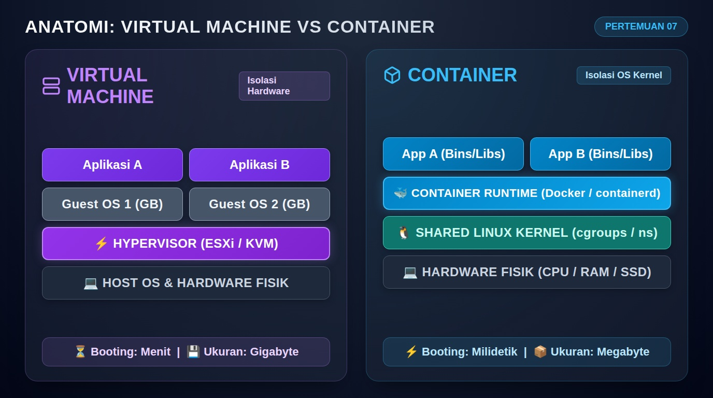
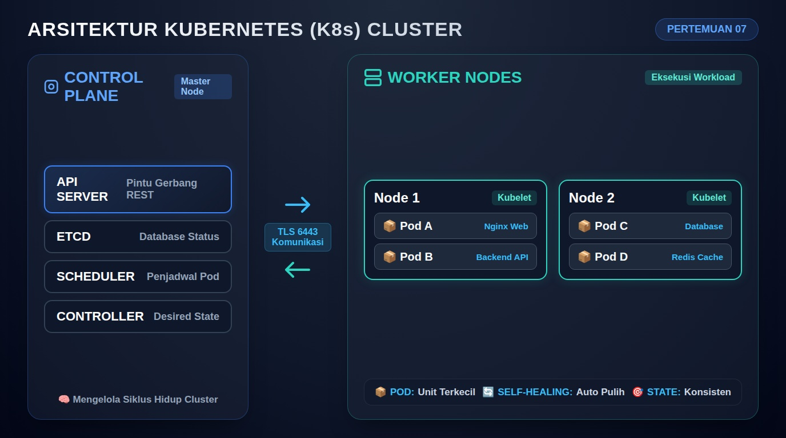

# Pertemuan 07: Containerization (Docker), Orkestrasi (Kubernetes), Storage & Networking

**Mata Kuliah:** Komputasi Awan (*Cloud Computing*)  
**Kode MK / Bobot:** TI433946 / 3 SKS  
**Sub-CPMK:** Mahasiswa mampu menguasai dan mempraktikkan Dasar Komputasi Awan, Infrastruktur, & Teknologi Pendukung Cloud (Sub-CPMK 1 & 3).  
*(Catatan: Modul ini mengintegrasikan materi Pertemuan 7 & Pertemuan 8 RPS: Containerization, Kubernetes Orchestration, Cloud Storage, Cloud Networking, serta Panduan Evaluasi Tengah Semester / UTS).*

---

## 1. Tujuan Pembelajaran
Setelah menyelesaikan materi pada pertemuan ini, mahasiswa diharapkan mampu:
1. Membedakan secara arsitektural antara isolasi perangkat keras (*Virtual Machine*) dan isolasi kernel (*Container*).
2. Memahami mekanisme internal Linux yang membentuk container (*Namespaces, Control Groups / cgroups, Union File System*).
3. Menganalisis arsitektur dasar Kubernetes (*Control Plane* vs *Worker Node*).
4. Menguasai konsep dasar penyimpanan terdistribusi (*Persistent Volumes*) dan jaringan container (*CNI & Services*).
5. **Mempraktikkan pembangunan multi-node Kubernetes Cluster nyata secara mandiri menggunakan varian teringan (K3s / KinD)**.
6. Menguji otomatisasi penskalaan (*scaling*) dan ketahanan kegagalan (*self-healing*) pada cluster Kubernetes.

---

## 2. Anatomi Containerization: Mengapa Lebih Ringan dari VM?

Jika mesin virtual (VM) menduplikasi seluruh sistem operasi termasuk kernel tersendiri, maka **Container berjalan langsung di atas kernel OS host yang sama**, dengan menciptakan ilusi ruang terisolasi (*user-space*) menggunakan fitur bawaan kernel Linux:



```
+------------------------------------+      +------------------------------------+
|       VIRTUAL MACHINE (VM)         |      |             CONTAINER              |
+------------------------------------+      +------------------------------------+
| App A      | App B                 |      | App A      | App B                 |
| Bins/Libs  | Bins/Libs             |      | Bins/Libs  | Bins/Libs             |
| Guest OS 1 | Guest OS 2 (Ukuran GB)|      +------------+-----------------------+
+------------+-----------------------+      | CONTAINER RUNTIME (Docker/containerd)
| HYPERVISOR (ESXi / KVM)            |      +------------------------------------+
+------------------------------------+      | LINUX KERNEL SHARED (cgroups/ns)   |
| HOST OS                            |      +------------------------------------+
+------------------------------------+      | HARDWARE FISIK (CPU, RAM, Disk)    |
| HARDWARE FISIK                     |      +------------------------------------+
+------------------------------------+
  - Waktu Booting: Hitungan menit              - Waktu Booting: Hitungan milidetik
  - Konsumsi RAM: Ratusan MB - Gigabyte        - Konsumsi RAM: Puluhan Megabyte
```

### Dua Pilar Utama Kernel Linux untuk Container:
1. **Linux Namespaces (Isolasi Visibilitas):**
   - `pid`: Proses di dalam container tidak dapat melihat proses di luar container.
   - `net`: Container memiliki kartu jaringan virtual, routing table, dan IP sendiri.
   - `mnt`: Container memiliki sistem file root (`/`) sendiri tanpa melihat file host.
   - `ipc`: Mencegah akses memori bersama antar-proses beda container.
   - `uts`: Memungkinkan container memiliki hostname sendiri.
2. **Control Groups (cgroups - Pembatasan Sumber Daya):**
   - Mengatur kuota maksimum CPU (misal: maksimal 0.5 core) dan batas RAM (misal: maksimal 256 MB) agar container tidak memonopoli sumber daya host.
3. **OverlayFS / UnionFS:**
   - Sistem file berlapis (*layered filesystem*) yang memungkinkan container berbagi image dasar yang sama secara *read-only*, dan hanya menulis perubahan pada lapisan paling atas (*writeable layer*).

---

## 3. Arsitektur Orkestrasi Kubernetes (K8s)

Ketika sistem memiliki ratusan container terdistribusi di puluhan server, kita membutuhkan sebuah **Orkestrator**. Kubernetes adalah standar industri *de-facto* yang bertindak sebagai "Sistem Operasi untuk Data Center".



```
+--------------------------------------------------------------------------+
|                       KUBERNETES CLUSTER ARCHITECTURE                    |
+--------------------------------------------------------------------------+
|  CONTROL PLANE (MASTER NODE)                                             |
|  +--------------------------------------------------------------------+  |
|  |  [ kube-apiserver ]  <--- Gerbang utama semua perintah (REST API)  |  |
|  |  [ etcd / sqlite ]   <--- Database status cluster (Desired State)  |  |
|  |  [ kube-scheduler ]  <--- Memilih worker mana yg cocok untuk Pod   |  |
|  |  [ kube-controller ] <--- Menjaga kondisi actual = desired state   |  |
|  +--------------------------------------------------------------------+  |
|                               |                                          |
|            +------------------+-------------------+                      |
|            | (Komunikasi TLS via Port 6443)       |                      |
|            v                                      v                      |
|  +-------------------------+         +-------------------------+         |
|  | WORKER NODE 1           |         | WORKER NODE 2           |         |
|  | [ kubelet ] (Agen node) |         | [ kubelet ] (Agen node) |         |
|  | [ kube-proxy ] (Jaringan|         | [ kube-proxy ] (Jaringan|         |
|  | [ containerd ] (Runtime)|         | [ containerd ] (Runtime)|         |
|  |   [ Pod ]    [ Pod ]    |         |   [ Pod ]    [ Pod ]    |         |
|  +-------------------------+         +-------------------------+         |
+--------------------------------------------------------------------------+
```

### Komponen Utama Kubernetes:
- **Pod:** Unit eksekusi terkecil di Kubernetes (dapat berisi satu atau lebih container yang berbagi alamat IP dan volume penyimpanan yang sama).
- **Deployment:** Pengontrol deklaratif yang mengatur siklus hidup, replikasi jumlah Pod, dan pembaruan versi tanpa *downtime* (*Rolling Updates*).
- **Service:** Abstraksi yang menyediakan alamat IP stabil dan penyeimbang beban (*load balancer*) internal untuk sekelompok Pod yang dinamis.

---

## 4. Fondasi Jaringan dan Penyimpanan Cloud/Container (Materi Pertemuan 8 RPS)

### 4.1 Cloud & Container Networking
- **Tantangan:** Pod di Kubernetes bersifat fana (*ephemeral*), bisa mati dan hidup kembali dengan alamat IP baru kapan saja.
- **Tipe Service Kubernetes:**
  1. **ClusterIP (Default):** Memberikan IP virtual internal yang hanya bisa diakses dari dalam cluster.
  2. **NodePort:** Membuka port statis pada setiap Worker Node (rentang 30000–32767) sehingga aplikasi dapat diakses langsung dari jaringan luar melalui `http://<IP-Node>:<NodePort>`.
  3. **LoadBalancer:** Mengintegrasikan pembuatan penyeimbang beban otomatis dari penyedia cloud publik (AWS NLB/ALB atau GCP Cloud Load Balancing).

### 4.2 Cloud Storage: Ephemeral vs Persistent
- Secara default, penyimpanan di dalam container bersifat **fana (*ephemeral*)**. Jika container restart, semua file baru di dalamnya akan terhapus.
- **Solusi Penyimpanan Tetap di Cloud/K8s:**
  - **Persistent Volume (PV):** Sumber daya penyimpanan fisik di level cluster (misal: folder lokal, NFS, atau AWS EBS / Ceph).
  - **Persistent Volume Claim (PVC):** Permintaan alokasi penyimpanan oleh pengembang aplikasi (misal: "Aplikasi ini membutuhkan disk 5 GB dengan mode ReadWriteOnce").

---

## 5. Praktikum Terpandu: Membangun Cluster Kubernetes (Varian Ter-ringan)

Untuk praktikum S1, kita memilih varian resmi bersertifikasi CNCF yang paling hemat sumber daya dan paling mudah dioperasikan di laptop mahasiswa: **K3s (oleh Rancher)** atau opsi kontainer **KinD (Kubernetes in Docker)**.

---

### OPSI A: Membangun Multi-Node Cluster dengan K3s (Sangat Direkomendasikan)
*K3s mengemas Kubernetes penuh ke dalam 1 file biner tunggal, mengganti etcd yang rakus memori dengan SQLite, dan hanya mengonsumsi RAM < 512 MB.*

#### Kasus: 2 Mahasiswa Terhubung ke Jaringan Wi-Fi/LAN yang Sama (atau 2 VM di 1 Laptop)
- **Node 1 (Master / Control Plane):** IP `192.168.1.10`
- **Node 2 (Worker Node):** IP `192.168.1.11`

#### Langkah 1: Inisialisasi Master Node (Di Komputer Mahasiswa 1 / Master)
Buka terminal Linux/WSL2, lalu jalankan perintah instalasi resmi K3s:
```bash
curl -sfL https://get.k3s.io | sh -
```
Tunggu sekitar 30 detik. Verifikasi bahwa Master Node telah aktif:
```bash
sudo kubectl get nodes
```
*(Status node harus berubah menjadi `Ready`)*.

Ambil token otentikasi agar Worker Node dapat bergabung:
```bash
sudo cat /var/lib/rancher/k3s/server/node-token
```
*(Salin string token yang muncul, misalnya: `K10abc123...::server:789xyz`)*.

#### Langkah 2: Menghubungkan Worker Node (Di Komputer Mahasiswa 2 / Worker)
Buka terminal di komputer Worker, lalu jalankan instalasi agen K3s dengan mengarahkan ke IP Master dan Token:
```bash
curl -sfL https://get.k3s.io | K3S_URL=https://192.168.1.10:6443 K3S_TOKEN="<TOKEN_YANG_DISALIN>" sh -
```

#### Langkah 3: Verifikasi Multi-Node Cluster (Di Komputer Master)
Jalankan kembali perintah verifikasi di komputer Master:
```bash
sudo kubectl get nodes -o wide
```
**Output yang diharapkan:**
```
NAME       STATUS   ROLES                  AGE     VERSION
master     Ready    control-plane,master   3m      v1.30.x+k3s1
worker-1   Ready    <none>                 45s     v1.30.x+k3s1
```
🎉 **Selamat! Anda berhasil membangun Multi-Node Kubernetes Cluster sejati!**

---

### OPSI B: Membangun Multi-Node Cluster Menggunakan KinD (1 Laptop Mandiri)
*Jika mahasiswa hanya memiliki 1 laptop tanpa jaringan luar, gunakan KinD (Kubernetes in Docker).*

1. Buat berkas konfigurasi cluster `kind-cluster.yaml`:
   ```yaml
   kind: Cluster
   apiVersion: kind.x-k8s.io/v1alpha4
   nodes:
     - role: control-plane
     - role: worker
     - role: worker
   ```
2. Jalankan perintah pembuatan cluster:
   ```bash
   kind create cluster --name k8s-kampus --config kind-cluster.yaml
   ```
3. Verifikasi:
   ```bash
   kubectl get nodes
   ```
   *(Akan tampil 3 node: 1 control-plane dan 2 worker node)*.

---

## 6. Praktikum Deployment Workload & Eksperimen Resiliensi (Self-Healing)

Setelah cluster terbentuk, lakukan uji coba penyebaran aplikasi web dan mekanisme penyembuhan mandiri (*self-healing*).

### Langkah 1: Buat Manifest Deployment dan Service Nginx
Buat berkas bernama `web-app.yaml`:
```yaml
apiVersion: apps/v1
kind: Deployment
metadata:
  name: nginx-deployment
spec:
  replicas: 3
  selector:
    matchLabels:
      app: web-kampus
  template:
    metadata:
      labels:
        app: web-kampus
    spec:
      containers:
      - name: nginx
        image: nginx:alpine
        ports:
        - containerPort: 80
---
apiVersion: v1
kind: Service
metadata:
  name: nginx-service
spec:
  type: NodePort
  selector:
    app: web-kampus
  ports:
    - port: 80
      targetPort: 80
      nodePort: 30080
```

### Langkah 2: Deploy Manifest ke Cluster
Terapkan berkas manifest tersebut:
```bash
kubectl apply -f web-app.yaml
```

Verifikasi bahwa 3 replika Pod telah berjalan tersebar di node-node:
```bash
kubectl get pods -o wide
kubectl get svc nginx-service
```

Buka peramban browser laptop Anda dan akses:
`http://<IP-Node-Anda>:30080`
*(Halaman "Welcome to nginx!" akan muncul)*.

---

### Langkah 3: Eksperimen "Self-Healing" (Uji Ketahanan Rusak)
Mari kita buktikan kecerdasan Kubernetes Controller dalam menjaga *Desired State*.

1. Periksa daftar Pod yang aktif:
   ```bash
   kubectl get pods
   ```
   *(Pilih salah satu nama Pod, misalnya: `nginx-deployment-77f5bf598-abc12`)*.
2. Hapus (bunuh) Pod tersebut secara paksa:
   ```bash
   kubectl delete pod nginx-deployment-77f5bf598-abc12
   ```
3. Langsung jalankan kembali perintah pemeriksaan Pod dalam hitungan detik:
   ```bash
   kubectl get pods
   ```
4. **Analisis Mahasiswa:** Perhatikan bahwa Kubernetes langsung mendeteksi jumlah pod aktif menjadi 2 (kurang dari *desired state* = 3). Secara instan dalam waktu < 2 detik, Kubernetes menjadwalkan dan memunculkan Pod pengganti baru dengan nama hash yang baru!

---

## 7. Panduan & Kisi-Kisi Ujian Tengah Semester (UTS)

Materi Ujian Tengah Semester mencakup topik dari **Pertemuan 01 s.d. Pertemuan 07** dengan bobot **20%** dari total nilai akhir semester.

### Format Evaluasi:
- **Bagian A (Teori Konseptual & Analitis - 50%):**
  - Menganalisis 5 karakteristik NIST dan pergeseran ekonomi CAPEX vs OPEX.
  - Menerapkan Teorema CAP dan model konsistensi data terdistribusi pada skenario aplikasi riil.
  - Memilih model SPI (IaaS, PaaS, SaaS) dan Deployment (Public, Private, Hybrid) berdasarkan batasan regulasi dan anggaran.
  - Menguraikan perbedaan mendasar Hypervisor Tipe 1 vs Tipe 2 dan mekanisme kernel Linux pada container (*cgroups & namespaces*).
- **Bagian B (Praktik & Logika Operasional Kubernetes - 50%):**
  - Menjelaskan fungsi masing-masing komponen Control Plane dan Worker Node Kubernetes.
  - Menganalisis berkas manifest YAML (Deployment, Service, Port Mapping).
  - Menjelaskan siklus kerja *Reconciliation Loop* (Self-Healing) saat sebuah Pod mengalami *crash*.
