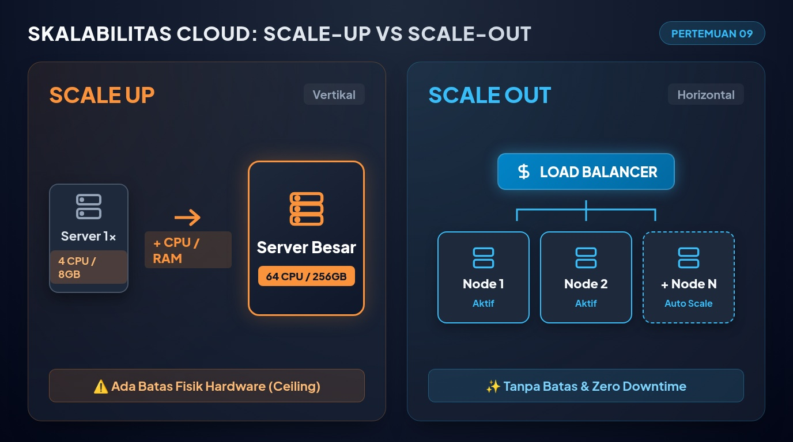
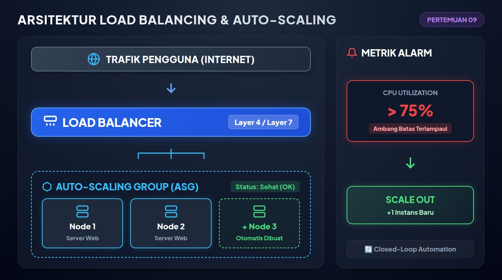

# Pertemuan 09: Skalabilitas, Elastisitas, dan Load Balancing

**Mata Kuliah:** Komputasi Awan (*Cloud Computing*)  
**Kode MK / Bobot:** TI433946 / 3 SKS  
**Sub-CPMK:** Mahasiswa mampu menguasai dan mempraktikkan Implementasi, Layanan Cloud, Tren, Isu, & Aplikasi Cloud Modern (Sub-CPMK 2 & 4).

---

## 1. Tujuan Pembelajaran
Setelah menyelesaikan materi pada pertemuan ini, mahasiswa diharapkan mampu:
1. Membedakan secara presisi konsep **Skalabilitas (*Scalability*)** dan **Elastisitas (*Elasticity*)**.
2. Menganalisis trade-off antara Skalabilitas Vertikal (*Scale-up*) dan Skalabilitas Horizontal (*Scale-out*).
3. Menguraikan arsitektur grup penskalaan otomatis (*Auto-Scaling Group*) beserta pemicu metriknya.
4. Menjelaskan cara kerja dan perbandingan algoritma penyeimbang beban (*Load Balancing Algorithm*).
5. Membedakan karakteristik penyeimbang beban **Layer 4 (Transport/TCP)** dan **Layer 7 (Aplikasi/HTTP)**.

---

## 2. Skalabilitas vs Elastisitas



Seringkali kedua istilah ini dianggap sama, padahal memiliki implikasi teknis dan finansial yang sangat berbeda dalam komputasi awan:

```
SKALABILITAS (Kemampuan Kapasitas)
Beban Naik   ======> Tambah Resource (Manual/Terencana)
Contoh: Memperbesar kapasitas server untuk promosi tahunan 1 bulan ke depan.

ELASTISITAS (Otomatisasi Adaptif Real-Time)
Beban Naik   ======> Otomatis Tambah Mesin (Scale Out)  | Bayar Lebih
Beban Turun  ======> Otomatis Matikan Mesin (Scale In)  | Hemat Biaya
Contoh: Server bertambah saat jam makan siang dan berkurang saat tengah malam.
```

### 2.1 Skalabilitas Vertikal (*Scale-Up / Scale-Down*)
- **Mekanisme:** Menambah atau mengurangi spesifikasi perangkat keras (menambah kapasitas vCPU, RAM, atau SSD) pada satu mesin server virtual yang sama.
- **Kelebihan:** Sangat mudah diimplementasikan, tidak memerlukan perubahan pada arsitektur aplikasi perangkat lunak (cocok untuk database monolitik).
- **Kekurangan:**
  - Memiliki batas fisik mutlak (*hardware ceiling*—tidak ada server fisik yang memiliki RAM tak terbatas).
  - Biasanya membutuhkan *reboot* (terjadi henti layanan sementara / *downtime*).
  - Biaya per gigabyte RAM melonjak secara eksponensial pada spesifikasi ekstrem (*diminishing returns*).

### 2.2 Skalabilitas Horizontal (*Scale-Out / Scale-In*)
- **Mekanisme:** Menambah atau mengurangi jumlah instans server virtual yang berjalan secara paralel di balik penyeimbang beban (*load balancer*).
- **Kelebihan:**
  - Kapasitas teoritis hampir tidak terbatas.
  - Toleran terhadap kegagalan (*fault tolerant*): jika 1 server mati, server lain tetap melayani trafik.
  - Nol *downtime* saat menambah kapasitas baru.
- **Kekurangan:** Aplikasi harus dirancang dengan paradigma **Stateless** (status sesi pengguna tidak boleh disimpan di memori lokal server, melainkan di cache terpusat seperti Redis).

---

## 3. Arsitektur Auto-Scaling Group (ASG)

Sistem penskalaan otomatis memantau metrik operasional secara *real-time* dan membuat keputusan penambahan/pengurangan instans berdasarkan aturan kebijakan (*policies*):

```
                       +-------------------------+
                       |   METRIK KINERJA CLOUD  |
                       | (CPU > 75% atau Latency)|
                       +------------+------------+
                                    | (Pemicu Alarm)
                                    v
                       +-------------------------+
                       |   AUTO-SCALING ENGINE   |
                       | (Menjalankan Kebijakan) |
                       +------------+------------+
                                    |
            +-----------------------+-----------------------+
            | (Scale Out: Tambah)                           | (Scale In: Hapus)
            v                                               v
+-----------------------+                       +-----------------------+
| Buat VM Baru dari AMI |                       | Hentikan VM Berlebih  |
| Daftarkan ke Target LB|                       | Lepaskan dari Target  |
+-----------------------+                       +-----------------------+
```

### Komponen Pengaturan ASG:
1. **Minimum Size:** Jumlah instans terendah yang wajib selalu hidup (misal: minimal 2 mesin untuk menjamin *High Availability* lintas zona).
2. **Maximum Size:** Batas pagu instans tertinggi untuk mencegah lonjakan tagihan tak terkendali (*budget guardrail*).
3. **Desired Capacity:** Jumlah instans target yang berjalan saat kondisi normal.
4. **Cooldown Period:** Masa jeda tunggu (misal: 300 detik) setelah aksi penskalaan dilakukan, guna memberi waktu bagi server baru untuk menyelesaikan proses *booting* dan stabilisasi sebelum metrik diukur kembali (mencegah efek osilasi liar / *thrashing*).

---

## 4. Konsep dan Algoritma Load Balancing



*Load Balancer* bertindak sebagai "polisi lalu lintas" di depan infrastruktur yang mendistribusikan permintaan klien secara merata ke kelompok server di belakangnya:

```
                  +-----------------------+
                  |  KLIEN INTERNET (WEB) |
                  +-----------+-----------+
                              |
                              v
                  +-----------------------+
                  |     LOAD BALANCER     |
                  +-----+-----------+-----+
                        |           |
            +-----------+           +-----------+
            v                                   v
+-----------------------+           +-----------------------+
|    Server Node A      |           |    Server Node B      |
| (Status: Sehat / OK)  |           | (Status: Sehat / OK)  |
+-----------------------+           +-----------------------+
```

### 4.1 Algoritma Distribusi Trafik:
1. **Round Robin:** Permintaan didistribusikan secara berurutan dan bergantian satu per satu ke setiap server ($Server_1 \to Server_2 \to Server_3 \to Server_1$). Asumsi: spesifikasi semua server identik.
2. **Weighted Round Robin:** Server dengan kapasitas hardware lebih besar diberi bobot (*weight*) lebih tinggi untuk menerima porsi trafik lebih banyak.
3. **Least Connections:** Permintaan baru secara cerdas diarahkan ke server yang saat itu memiliki jumlah koneksi aktif paling sedikit. Sangat ideal untuk transaksi yang memakan waktu lama (seperti unggah berkas besar).
4. **IP Hash (Source IP Affinity):** Alamat IP klien di-hash secara matematis untuk menentukan server mana yang melayaninya. Klien yang sama akan selalu diarahkan ke server yang sama (berguna untuk *Sticky Sessions*).

### 4.2 Layer 4 (NLB) vs Layer 7 (ALB) Load Balancer:

| Fitur Evaluasi | Layer 4 Load Balancer (NLB) | Layer 7 Load Balancer (ALB) |
| :--- | :--- | :--- |
| **Lapisan OSI** | Lapisan Transport (Protokol TCP/UDP). | Lapisan Aplikasi (Protokol HTTP/HTTPS, gRPC, WebSocket). |
| **Kriteria Perutean** | Hanya berdasarkan IP Pengirim/Tujuan dan Port. | Berdasarkan URL Path (`/api`, `/images`), Header HTTP, Cookie. |
| **Performa & Latensi** | Ultra cepat, *throughput* jutaan request/detik. | Sedikit lebih berat (karena melakukan inspeksi isi paket HTTP). |
| **SSL/TLS Termination** | Melewatkan paket terenkripsi (*TCP Pass-through*). | Mendekripsi sertifikat SSL di LB (*SSL Offloading*). |

---

## 5. Eksperimen Mandiri: Konfigurasi Load Balancer Sederhana

Mahasiswa dapat mengonfigurasi penyeimbang beban menggunakan berkas `nginx.conf` lokal:

```nginx
http {
    # Mendefinisikan kelompok server backend
    upstream cluster_aplikasi {
        # Menggunakan algoritma Least Connections
        least_conn;
        server 192.168.1.10:80 weight=2;
        server 192.168.1.11:80 weight=1;
    }

    server {
        listen 80;
        server_name loadbalancer.kampus.ac.id;

        location / {
            proxy_pass http://cluster_aplikasi;
            proxy_set_header Host $host;
            proxy_set_header X-Real-IP $remote_addr;
        }
    }
}
```

---

## 6. Latihan Analisis Kasus

Sebuah portal media berita daring mengalami lonjakan pembaca hingga 20x lipat saat terjadi pengumuman pemilihan umum. Aplikasi berita tersebut memiliki dua modul:
1. Modul Halaman Berita Statis (Teks dan Foto).
2. Modul Kolom Komentar Interaktif (Pengguna mengirim opini real-time).

**Pertanyaan Analisis:**
1. Mengapa memisahkan kedua modul di atas ke dalam target group yang berbeda menggunakan **Layer 7 Load Balancer** jauh lebih efektif dibandingkan menggunakan Layer 4?
2. Usulkan strategi *Auto-Scaling* (metrik apa yang dijadikan pemicu: apakah CPU Utilization, Network In, atau Request Count per Target)? Berikan alasannya!
