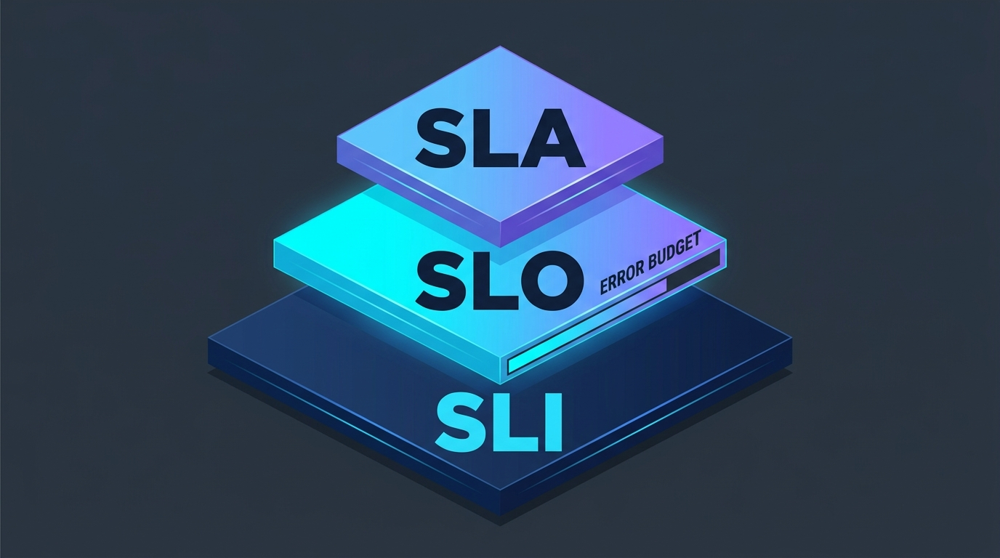
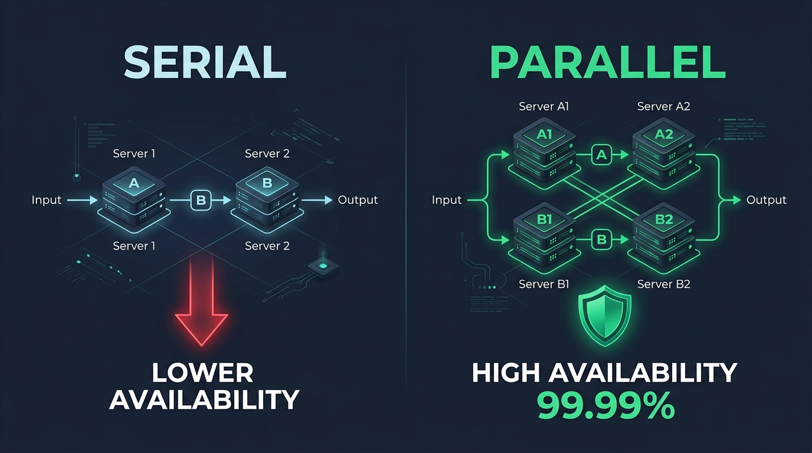

# Pertemuan 10: Manajemen Layanan Cloud (SLA, QoS, dan Ketersediaan Tinggi)

**Mata Kuliah:** Komputasi Awan (*Cloud Computing*)  
**Kode MK / Bobot:** TI433946 / 3 SKS  
**Sub-CPMK:** Mahasiswa mampu menguasai dan mempraktikkan Implementasi, Layanan Cloud, Tren, Isu, & Aplikasi Cloud Modern (Sub-CPMK 2 & 4).

---

## 1. Tujuan Pembelajaran
Setelah menyelesaikan materi pada pertemuan ini, mahasiswa diharapkan mampu:
1. Membedakan secara presisi hierarki **SLI (*Service Level Indicator*)**, **SLO (*Service Level Objective*)**, dan **SLA (*Service Level Agreement*)**.
2. Menguasai perhitungan matematis toleransi waktu henti (*downtime*) berdasarkan persentase ketersediaan (*The Nines*).
3. Menghitung ketersediaan gabungan pada sistem komposit (*Serial vs Parallel Availability Architecture*).
4. Menganalisis metrik kualitas layanan (*Quality of Service / QoS*) dan klausul kompensasi finansial (*Service Credits*).

---

## 2. Triad Manajemen Layanan: SLI, SLO, dan SLA



Dalam operasional komputasi awan modern (terutama metodologi *Site Reliability Engineering / SRE*), manajemen layanan diatur melalui tiga tingkatan:

```
[ SLI: Service Level Indicator ]  --> "Apa metrik riil yang kita ukur?"
       | (Contoh: 99.5% dari HTTP request selesai dalam waktu < 200 ms)
       v
[ SLO: Service Level Objective ]  --> "Berapa target performa internal tim kita?"
       | (Contoh: Target internal tim: 99.9% uptime per bulan)
       v
[ SLA: Service Level Agreement ]  --> "Berapa janji legal kita ke pelanggan + sanksi?"
         (Contoh: Jika uptime < 99.5%, pelanggan berhak atas pengembalian dana 10%)
```

### Konsep *Error Budget* (Anggaran Kesalahan):
- **Rumus:** $\text{Error Budget} = 100\% - \text{SLO}$
- Jika sistem memiliki SLO ketersediaan sebesar **99.9%**, maka sistem memiliki *Error Budget* sebesar **0.1%** waktu henti yang ditoleransi.
- Selama *Error Budget* masih tersisa, tim pengembang bebas merilis fitur-fitur baru. Namun jika *Error Budget* habis (sering terjadi insiden), seluruh rilis fitur baru dibekukan (*freeze*), dan tim wajib fokus 100% pada perbaikan stabilitas infrastruktur.

---

## 3. Matematika Ketersediaan: *"The Nines"*

Tingkat keandalan cloud diukur dalam persentase ketersediaan (*Availability*). Rumus dasar ketersediaan adalah:

$$\text{Availability } (A) = \frac{\text{MTBF}}{\text{MTBF} + \text{MTTR}} \times 100\%$$

Di mana:
- **MTBF (*Mean Time Between Failures*):** Rata-rata durasi sistem beroperasi normal sebelum mengalami kerusakan.
- **MTTR (*Mean Time To Repair*):** Rata-rata durasi yang dibutuhkan tim teknis untuk memulihkan sistem kembali menyala normal.

### Tabel Toleransi Waktu Henti (*Downtime*) Sistem:

| Tingkat Ketersediaan | Nama Istilah | Toleransi Henti / Tahun | Toleransi Henti / Bulan | Toleransi Henti / Hari |
| :--- | :--- | :---: | :---: | :---: |
| **99%** | *Two Nines* | 3.65 hari | 7.31 jam | 14.4 menit |
| **99.9%** | *Three Nines* | 8.77 jam | 43.83 menit | 1.44 menit |
| **99.95%** | *Tiga Setengah 9* | 4.38 jam | 21.92 menit | 43.2 detik |
| **99.99%** | *Four Nines* | 52.60 menit | 4.38 menit | 8.64 detik |
| **99.999%** | *Five Nines* | 5.26 menit | 26.30 detik | 0.86 detik |

> **Fakta Industri:** Setiap penambahan satu angka "9" di belakang koma membutuhkan investasi biaya infrastruktur yang meningkat secara eksponensial (memerlukan redundansi server multi-region, failover instan, dan storage terdistribusi).

---

## 4. Perhitungan Ketersediaan Sistem Komposit



Sebuah aplikasi di cloud terdiri dari banyak komponen (Web Server, Database, Load Balancer). Cara komponen-komponen tersebut dirangkai menentukan ketersediaan total sistem.

### 4.1 Rangkaian Komponen Serial (Berantai)
Jika komponen dirangkai secara seri, di mana kegagalan **salah satu komponen** menyebabkan seluruh sistem mati:

$$A_{\text{total}} = A_1 \times A_2 \times A_3 \times \dots \times A_n$$

```
[ Web Server (99.9%) ] ----> [ Database (99.9%) ]
Ketersediaan Total = 0.999 * 0.999 = 0.998001 (99.80%)
*Catatan: Ketersediaan akhir SELALU LEBIH RENDAH daripada komponen terlemah.*
```

### 4.2 Rangkaian Komponen Paralel (Redundan)
Jika komponen dirangkai secara paralel (misal: 2 Web Server identik di balik Load Balancer), di mana sistem tetap hidup selama **minimal salah satu komponen** masih berfungsi:

$$A_{\text{total}} = 1 - \left( (1 - A_1) \times (1 - A_2) \right)$$

```
          +---> [ Web Server 1 (99%) ] ---+
          |                               |
[ Input ]-+                               +---> [ Output ]
          |                               |
          +---> [ Web Server 2 (99%) ] ---+

Peluang Server 1 mati = 1 - 0.99 = 0.01 (1%)
Peluang Server 2 mati = 1 - 0.99 = 0.01 (1%)
Peluang KEDUA server mati bersamaan = 0.01 * 0.01 = 0.0001 (0.01%)
Ketersediaan Total = 1 - 0.0001 = 0.9999 (99.99%)
*Catatan: Redundansi paralel MENINGKATKAN keandalan sistem secara drastis!*
```

---

## 5. Metrik Quality of Service (QoS)

Selain ketersediaan hidup/mati, pengalaman pengguna ditentukan oleh metrik kualitas layanan:

1. **Latency (Latensi):** Total waktu yang dibutuhkan paket data untuk melakukan perjalanan bolak-balik dari pengirim ke penerima (*Round-Trip Time / RTT*). Terdiri dari *propagation delay*, *queuing delay*, dan *processing delay*.
2. **Throughput:** Volume aktual data yang berhasil ditransmisikan melalui kanal komunikasi per satuan waktu (misal: Megabit per detik / Mbps).
3. **Jitter:** Variasi fluktuasi dalam keterlambatan kedatangan paket data. Jitter yang tinggi sangat merusak aplikasi *real-time* seperti panggilan suara (VoIP) dan konferensi video.
4. **Packet Loss:** Persentase paket data yang gagal sampai ke tujuan akibat kemacetan jaringan (*network congestion*).

---

## 6. Latihan Matematis & Studi Kasus (Tugas Mandiri)

### Soal Perhitungan Arsitektur:
Sebuah sistem cloud dirancang dengan topologi sebagai berikut:
1. Sebuah **Load Balancer** dengan SLA ketersediaan **99.99%**.
2. Dua buah **Web Server** paralel yang masing-masing memiliki SLA **99.0%**.
3. Dua buah **Database Server** paralel (Master-Standby dengan auto-failover) yang masing-masing memiliki SLA **99.5%**.

```
[ Load Balancer (99.99%) ]
           |
           v
[ 2x Web Server Paralel (99.0% & 99.0%) ]
           |
           v
[ 2x Database Paralel (99.5% & 99.5%) ]
```

### Pertanyaan:
1. Hitung ketersediaan efektif (*Effective Availability*) dari subsistem Web Server paralel!
2. Hitung ketersediaan efektif dari subsistem Database paralel!
3. Hitung ketersediaan total ($A_{\text{total}}$) dari keseluruhan sistem terintegrasi tersebut!
4. Berapa menit toleransi *downtime* sistem ini dalam kurun waktu satu bulan (30 hari)?
