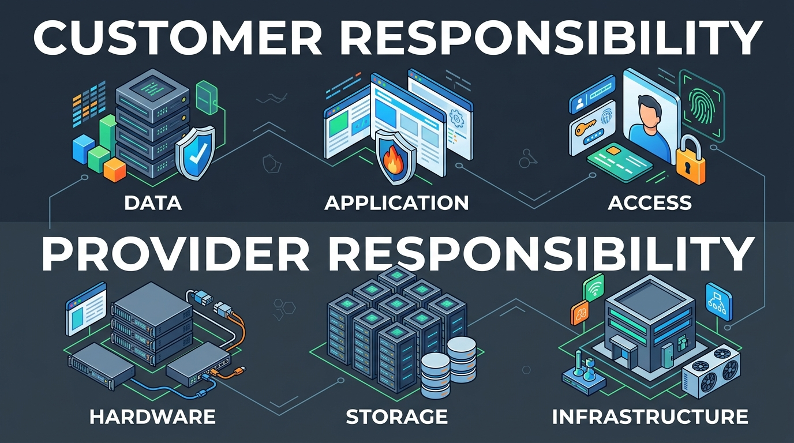
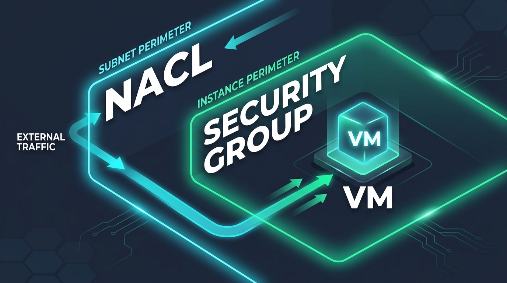

# Pertemuan 11: Keamanan Komputasi Awan (IAM, Enkripsi, dan Isolasi Jaringan)

**Mata Kuliah:** Komputasi Awan (*Cloud Computing*)  
**Kode MK / Bobot:** TI433946 / 3 SKS  
**Sub-CPMK:** Mahasiswa mampu menguasai dan mempraktikkan Implementasi, Layanan Cloud, Tren, Isu, & Aplikasi Cloud Modern (Sub-CPMK 2 & 4).

---

## 1. Tujuan Pembelajaran
Setelah menyelesaikan materi pada pertemuan ini, mahasiswa diharapkan mampu:
1. Menganalisis batas keamanan menggunakan **Shared Responsibility Model** pada berbagai model layanan.
2. Merancang kebijakan hak akses berbasis prinsip **Least Privilege** menggunakan berkas kebijakan *Identity and Access Management (IAM)*.
3. Membedakan mekanisme perlindungan data: *Data-at-Rest*, *Data-in-Transit*, dan *Data-in-Use*.
4. Membedakan firewall tingkat instans (**Security Group**) dan firewall tingkat subnet (**Network Access Control List / NACL**).

---

## 2. Model Tanggung Jawab Bersama (*Shared Responsibility Model*)



Mitos terbesar dalam komputasi awan adalah anggapan bahwa *"jika sudah pindah ke cloud, maka seluruh keamanan otomatis dijamin oleh penyedia"*. Faktanya, keamanan di cloud adalah kemitraan bersama antara penyedia dan konsumen:

```
+-------------------------------------------------------------------------+
|                  SHARED RESPONSIBILITY MODEL MATRIKS                    |
+-------------------------------------------------------------------------+
| Lapisan Keamanan        |     IaaS      |     PaaS      |     SaaS      |
+-------------------------+---------------+---------------+---------------+
| Data & Akses Pengguna   | Pelanggan     | Pelanggan     | Pelanggan     |
| Aplikasi & Kode Sumber  | Pelanggan     | Pelanggan     | Penyedia Cloud|
| Sistem Operasi (OS)     | Pelanggan     | Penyedia Cloud| Penyedia Cloud|
| Jaringan Jaringan & VM  | Pelanggan     | Penyedia Cloud| Penyedia Cloud|
| Virtualisasi/Hypervisor | Penyedia Cloud| Penyedia Cloud| Penyedia Cloud|
| Hardware Fisik Server   | Penyedia Cloud| Penyedia Cloud| Penyedia Cloud|
| Keamanan Fisik Gedung   | Penyedia Cloud| Penyedia Cloud| Penyedia Cloud|
+-------------------------------------------------------------------------+
```

- **Security OF the Cloud (Tanggung Jawab Penyedia):** Melindungi infrastruktur global, perangkat keras fisik, pendingin, genset, jaringan kabel, dan perangkat lunak hypervisor dari serangan atau penyusupan fisik.
- **Security IN the Cloud (Tanggung Jawab Pelanggan):** Mengatur kata sandi pengguna, mengonfigurasi firewall, menambal celah (*patching*) OS mesin virtual, dan mengenkripsi basis data.

> **Hukum Utama:** *"Penyedia menjamin keamanan brankas baja tempat Anda menyimpan barang, namun Anda sendiri yang bertanggung jawab mengunci pintunya dan memegang kuncinya."*

---

## 3. Identity and Access Management (IAM)

IAM adalah sistem sentral untuk mengontrol identitas (*siapa*) yang memiliki hak otorisasi (*dapat melakukan apa*) terhadap sumber daya cloud (*pada aset yang mana*).

### 3.1 Prinsip Hak Istimewa Terkecil (*Principle of Least Privilege*)
Pengguna, aplikasi, atau sistem hanya boleh diberikan hak akses minimum absolut yang mereka butuhkan untuk menyelesaikan tugas pekerjaan mereka, dan tidak lebih.

### 3.2 Anatomi Berkas Kebijakan IAM (JSON Policy)
Kebijakan akses di cloud modern ditulis secara deklaratif dalam format JSON:

```json
{
  "Version": "2012-10-17",
  "Statement": [
    {
      "Sid": "IzinkanBacaBucketFoto",
      "Effect": "Allow",
      "Principal": {
        "AWS": "arn:aws:iam::123456789012:user/budi_analis"
      },
      "Action": [
        "s3:GetObject",
        "s3:ListBucket"
      ],
      "Resource": [
        "arn:aws:s3:::bucket-foto-kampus",
        "arn:aws:s3:::bucket-foto-kampus/*"
      ],
      "Condition": {
        "IpAddress": {
          "aws:SourceIp": "192.168.1.0/24"
        }
      }
    }
  ]
}
```

- **Effect:** Apakah aksi ini diizinkan (`Allow`) atau dilarang keras (`Deny`).
- **Action:** Operasi API spesifik yang diizinkan (misal: hanya membaca, tidak boleh menghapus `s3:DeleteObject`).
- **Resource:** Target sumber daya yang dikenakan aturan.
- **Condition:** Syarat konteks tambahan (misal: hanya boleh diakses dari rentang IP kantor kampus).

---

## 4. Enkripsi Data di Komputasi Awan

Perlindungan data terbagi ke dalam tiga kondisi siklus hidup (*data lifecycle*):

```
+-------------------------------------------------------------------------+
|                  TIGA KONDISI PERLINDUNGAN ENKRIPSI DATA                |
+-------------------------------------------------------------------------+
| 1. Data-in-Transit (Dalam Perjalanan)                                   |
|    - Mengamankan data yang melintasi jaringan internet publik           |
|    - Standar: TLS 1.3 (Transport Layer Security), HTTPS, IPsec VPN      |
+-------------------------------------------------------------------------+
| 2. Data-at-Rest (Dalam Media Penyimpanan)                               |
|    - Mengamankan data yang tersimpan di disk harddisk, SSD, atau bucket |
|    - Standar: Algoritma simetris AES-256 (Advanced Encryption Standard) |
|    - Manajemen Kunci: KMS (Key Management Service) & Envelope Encryption|
+-------------------------------------------------------------------------+
| 3. Data-in-Use (Dalam Pemrosesan Memori / CPU)                          |
|    - Mencegah administrator host/hypervisor mengintip isi memori RAM    |
|    - Standar: Confidential Computing (Hardware Enclave: Intel SGX/SEV)  |
+-------------------------------------------------------------------------+
```

---

## 5. Keamanan Jaringan Cloud: Security Groups vs NACLs



Di dalam Virtual Private Cloud (VPC), perlindungan lalu lintas data paket dilakukan secara berlapis:

```
[ Internet Luar ]
       |
       v
+-------------------------------------------------------------+
| SUBNET CLOUD                                                |
|  +-------------------------------------------------------+  |
|  | [ NACL (Network Access Control List) ]                |  |
|  | Tingkat Subnet, Stateless (Butuh aturan In & Out)     |  |
|  +---------------------------+---------------------------+  |
|                              |                              |
|                              v                              |
|         +-----------------------------------------+         |
|         | [ SECURITY GROUP ]                      |         |
|         | Tingkat Virtual NIC / Instans           |         |
|         | Stateful (Jika Masuk Boleh, Keluar Auto)|         |
|         +--------------------+--------------------+         |
|                              |                              |
|                              v                              |
|                   [ Mesin Virtual (VM) ]                    |
+-------------------------------------------------------------+
```

| Parameter Perbandingan | Security Group (SG) | Network Access Control List (NACL) |
| :--- | :--- | :--- |
| **Tingkat Perlindungan** | Instans / Virtual NIC (*ENI*). | Subnet secara keseluruhan. |
| **Sifat Status (*State*)** | **Stateful:** Jika paket masuk (*inbound*) diizinkan, paket balasan (*outbound*) otomatis diizinkan. | **Stateless:** Paket masuk dan paket keluar harus dievaluasi secara terpisah melalui aturan eksplisit. |
| **Jenis Aturan** | Hanya mendukung aturan **Allow** (Secara implisit semua yang lain ditolak). | Mendukung aturan eksplisit **Allow** dan **Deny**. |
| **Urutan Evaluasi** | Semua aturan dievaluasi bersamaan. | Dievaluasi berurutan berdasarkan nomor urut (*Rule Number* terendah dieksekusi duluan). |

---

## 6. Latihan Analisis Kasus Pelanggaran Keamanan

### Kasus Nyata:
Sebuah perusahaan asuransi menyimpan jutaan riwayat klaim medis nasabah di layanan Object Storage Cloud (S3 Bucket). Suatu hari, berkas-berkas tersebut ditemukan bocor di internet publik.

Setelah investigasi forensik digital, ditemukan fakta bahwa:
1. Pusat data fisik penyedia cloud tidak pernah disusupi.
2. Seorang karyawan IT junior mematikan opsi *"Block Public Access"* pada konfigurasi bucket dan menetapkan izin `Principal: "*"` serta `Action: "s3:GetObject"` agar tim vendor luar dapat mengunduh berkas dengan cepat.

### Pertanyaan Analisis Mahasiswa:
1. Berdasarkan *Shared Responsibility Model*, pihak manakah yang memikul tanggung jawab hukum dan etika atas kebocoran data tersebut (Penyedia Cloud atau Pelanggan Asuransi)?
2. Rekomendasikan tiga langkah teknis preventif (misalnya: integrasi IAM, otorisasi berbasis MFA, dan audit berkala) untuk mencegah kejadian serupa terulang kembali!
