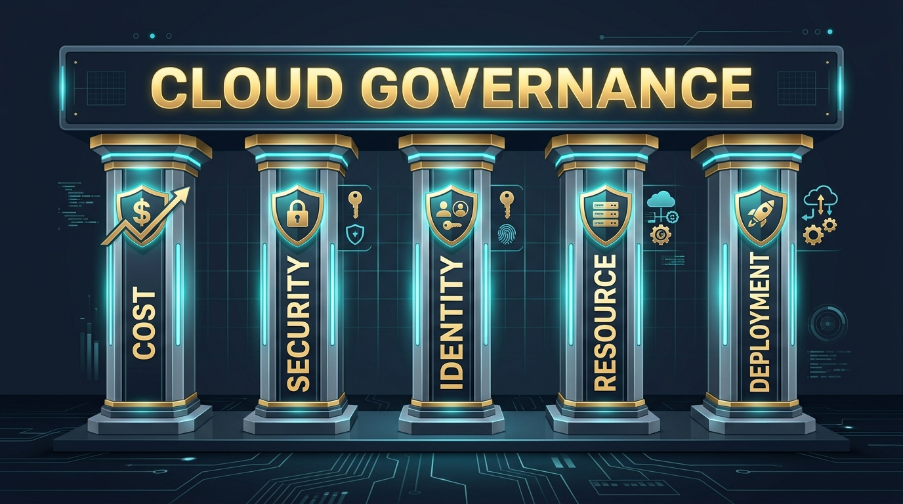
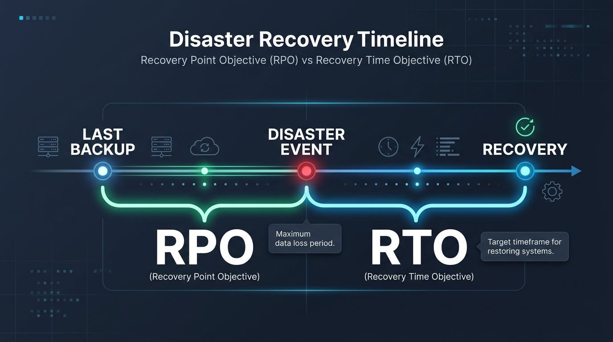

# Pertemuan 12: Tata Kelola (*Governance*), Kepatuhan Regulasi, dan Manajemen Risiko Cloud

**Mata Kuliah:** Komputasi Awan (*Cloud Computing*)  
**Kode MK / Bobot:** TI433946 / 3 SKS  
**Sub-CPMK:** Mahasiswa mampu menguasai dan mempraktikkan Implementasi, Layanan Cloud, Tren, Isu, & Aplikasi Cloud Modern (Sub-CPMK 2 & 4).

---

## 1. Tujuan Pembelajaran
Setelah menyelesaikan materi pada pertemuan ini, mahasiswa diharapkan mampu:
1. Menguraikan pilar-pilar utama dalam kerangka tata kelola komputasi awan (*Cloud Governance Framework*).
2. Mengukur dan memitigasi risiko strategis cloud: *Vendor Lock-in*, *Data Sovereignty*, dan ancaman henti operasional.
3. Menganalisis parameter **RPO (*Recovery Point Objective*)** dan **RTO (*Recovery Time Objective*)** dalam perencanaan pemulihan bencana (*Disaster Recovery*).
4. Menjelaskan kepatuhan terhadap regulasi internasional (ISO 27001, SOC 2, GDPR) dan regulasi nasional **UU PDP No. 27 Tahun 2022 di Indonesia**.
5. Mengintegrasikan prinsip etika amanah data dan tanggung jawab moral digital (CPL02).

---

## 2. Kerangka Tata Kelola Komputasi Awan (*Cloud Governance*)



*Cloud Governance* adalah seperangkat aturan, kebijakan, dan proses pengawasan terstruktur untuk memastikan pemanfaatan teknologi cloud berjalan secara efisien, aman, terkendali secara finansial, dan selaras dengan tujuan strategis organisasi.

```
+--------------------------------------------------------------------------+
|                     5 PILAR TATA KELOLA CLOUD UTAMA                      |
+--------------------------------------------------------------------------+
|  1. Cost Management (FinOps)  --> Pengendalian anggaran & tagging aset   |
|  2. Security Baseline         --> Standarisasi firewall & audit celah    |
|  3. Identity Baseline         --> Penegakan MFA & kontrol akses sentral  |
|  4. Resource Consistency      --> Otomasi penamaan & kepatuhan region    |
|  5. Deployment Acceleration   --> Standarisasi via IaC (Terraform)       |
+--------------------------------------------------------------------------+
```

### Mekanisme Pengawasan Otomatis (Policy-as-Code):
Penyedia cloud modern menyediakan mekanisme pencegahan terpusat (misal: *AWS Service Control Policies / SCPs* atau *Azure Policy*), contohnya:
- Larangan keras membuat instans VM di luar wilayah Region Jakarta (`ap-southeast-3`).
- Otomatis mematikan (*terminate*) mesin yang tidak memiliki tag `Owner` dan `CostCenter`.
- Larangan membuka port database (port 3306/5432) ke internet publik (`0.0.0.0/0`).

---

## 3. Manajemen Risiko di Komputasi Awan

### 3.1 Risiko Keterikatan Vendor (*Vendor Lock-in*)
- **Dampak:** Organisasi kesulitan bermigrasi ke penyedia cloud lain karena terlanjur menggunakan API atau format data kepemilikan tertutup (*proprietary*) vendor tertentu.
- **Strategi Mitigasi:**
  - Mengadopsi teknologi berbasis standar terbuka (*Open Source & Cloud Native*): gunakan **Docker** dan **Kubernetes** daripada layanan orkestrasi tertutup.
  - Membangun infrastruktur menggunakan alat deklaratif agnostik seperti **Terraform** / **OpenTofu**.

### 3.2 Risiko Kedaulatan Data (*Data Sovereignty*)
Hukum dan yurisdiksi suatu negara berlaku terhadap data yang disimpan di dalam wilayah fisik negara tersebut. Misalnya, data sensitif warga negara Indonesia yang disimpan di data center Singapura tunduk pada hukum peradilan Singapura.

---

## 4. Strategi Pemulihan Bencana (*Disaster Recovery / DR*)



Dalam manajemen risiko, ketahanan sistem diukur melalui dua parameter kunci:

```
[ WAKTU KEJADIAN BENCANA ]
       <------------------ RPO ------------------>|<------------------ RTO ------------------>
Titik Terakhir Backup Tersedia                   Titik Bencana Terjadi           Sistem Pulih Kembali
(Data yang hilang selama jeda ini)               (Waktu henti operasional / Downtime)
```

1. **RPO (*Recovery Point Objective*):** Batas toleransi maksimum hilangnya data yang diukur dalam satuan waktu sebelum bencana terjadi (misal: jika backup harian dilakukan jam 00:00 dan bencana terjadi jam 14:00, maka data 14 jam hilang).
2. **RTO (*Recovery Time Objective*):** Durasi waktu maksimum yang ditoleransi bagi tim teknis untuk memulihkan aplikasi kembali daring setelah bencana terjadi.

### 4 Spektrum Strategi Disaster Recovery:

| Strategi DR | Waktu RPO / RTO | Biaya Operasional | Deskripsi Arsitektur |
| :--- | :---: | :---: | :--- |
| **1. Backup & Restore** | Jam - Hari | Sangat Murah | Data di-backup berkala ke cloud lain, server baru dibangun manual saat darurat. |
| **2. Pilot Light** | Puluhan Menit | Murah | Database terus direplikasi aktif di region DR, tetapi server aplikasi dimatikan (hanya dinyalakan saat bencana). |
| **3. Warm Standby** | Hitungan Menit | Sedang | Lingkungan replika penuh berjalan di region DR dengan kapasitas minimal, lalu diskalakan naik saat bencana. |
| **4. Multi-Region Active-Active** | Hampir Nol (Detik) | Sangat Mahal | Trafik dibagi serentak ke 2 region dunia yang berbeda. Jika 1 region mati, region lain langsung melayani seluruh beban. |

---

## 5. Kepatuhan Regulasi: Global vs Nasional Indonesia

1. **Standar Global:**
   - **ISO/IEC 27001:** Standar sertifikasi sistem manajemen keamanan informasi.
   - **SOC 2 Type II:** Laporan audit independen terkait keamanan, ketersediaan, dan privasi data pelanggan.
   - **GDPR (General Data Protection Regulation):** Regulasi perlindungan data pribadi Uni Eropa yang memberikan hak pengguna untuk dihapus datanya (*Right to be Forgotten*).
2. **Kepatuhan Regulasi di Indonesia:**
   - **UU PDP No. 27 Tahun 2022 (Pelindungan Data Pribadi):** Mewajibkan pengendali data pribadi memiliki dasar pemrosesan yang sah, persetujuan eksplisit (*consent*), menjamin kerahasiaan data, serta mengenakan sanksi pidana dan denda hingga miliaran rupiah atas kebocoran data.
   - **Peraturan Pemerintah No. 71 Tahun 2019 (PSTE):** Mengatur kewajiban pengelolaan sistem dan transaksi elektronik yang andal dan aman bagi sektor publik dan privat.

---

## 6. Integrasi Nilai Etika dan Tanggung Jawab Keilmuan (CPL02)

Dalam pandangan etika keilmuan dan ajaran Islam (*Islamisasi Ilmu Pengetahuan*):
- **Amanah Data (*Trustworthiness*):** Informasi pribadi masyarakat (nomor identitas kependudukan, riwayat finansial, catatan medis) adalah titipan amanah yang suci. Menyimpan data di cloud tanpa proteksi yang layak merupakan bentuk pengkhianatan terhadap amanah publik.
- **Keadilan Finansial (*Adl*):** Pengelolaan *FinOps* mencegah pemborosan dana operasional organisasi yang seharusnya dapat dialokasikan untuk kemaslahatan umat.

---

## 7. Studi Kasus dan Diskusi Kelompok

### Skenario:
Sebuah perusahaan dompet digital (*Fintech*) di Indonesia ingin memindahkan seluruh sistem transaksi ke penyedia Public Cloud global yang server fisiknya berada di luar negeri untuk menghemat biaya lisensi.

### Pertanyaan Analisis:
1. Analisis potensi pelanggaran hukum regulasi **UU PDP No. 27 Tahun 2022** dan regulasi Bank Indonesia terkait transfer data lintas batas (*Cross-Border Data Transfer*) pada skenario di atas!
2. Jika Anda adalah Chief Technology Officer (CTO), arsitektur deployment apa yang akan Anda ajukan ke dewan direksi untuk menyeimbangkan antara efisiensi biaya dan kepatuhan hukum nasional?
