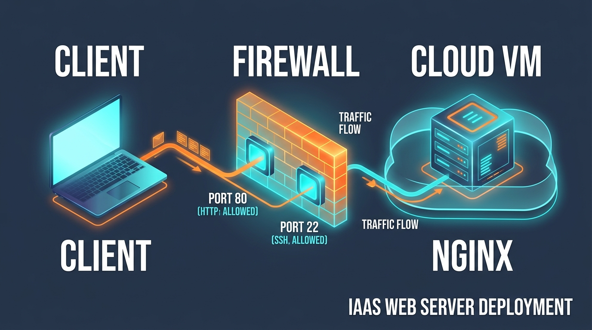
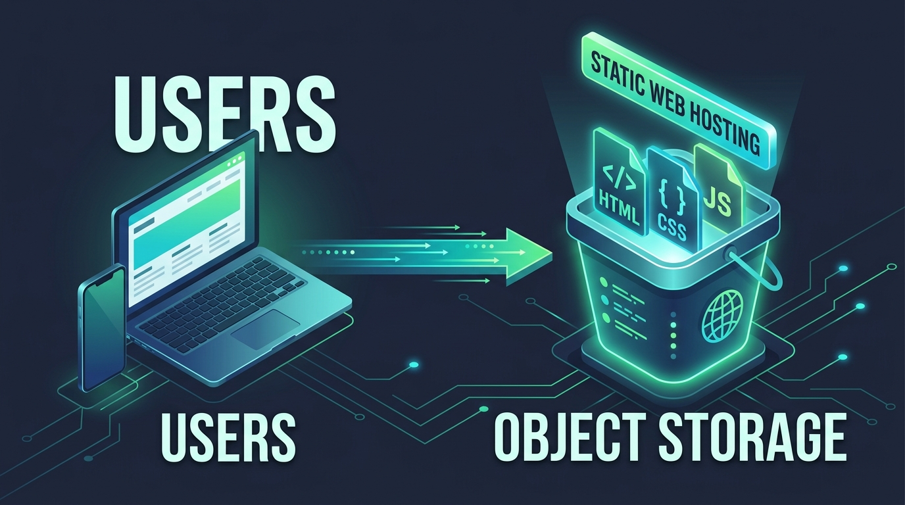

# Pertemuan 13: Praktikum Deployment Layanan Web di Cloud Publik

**Mata Kuliah:** Komputasi Awan (*Cloud Computing*)  
**Kode MK / Bobot:** TI433946 / 3 SKS  
**Sub-CPMK:** Mahasiswa mampu menguasai dan mempraktikkan Implementasi, Layanan Cloud, Tren, Isu, & Aplikasi Cloud Modern (Sub-CPMK 2 & 4).

---

## 1. Tujuan Pembelajaran
Setelah menyelesaikan praktikum pada pertemuan ini, mahasiswa diharapkan mampu:
1. Menavigasi konsol manajemen penyedia cloud publik utama (AWS / Google Cloud / Microsoft Azure).
2. Melakukan *provisioning* mesin virtual IaaS, mengonfigurasi *Firewall/Security Groups*, dan men-deploy web server aktif.
3. Mengoperasikan otomasi infrastruktur menggunakan antarmuka baris perintah (*Command-Line Interface / CLI*).
4. Men-deploy aplikasi web statis menggunakan layanan *Cloud Object Storage*.

---

## 2. Pilihan Lingkungan Praktikum Mahasiswa

Untuk mengakomodasi mahasiswa yang belum memiliki kartu kredit untuk mendaftar akun cloud komersial, praktikum ini menyediakan **3 jalur alternatif yang setara**:

```
+-------------------------------------------------------------------------+
|                  PILIHAN JALUR PRAKTIKUM MAHASISWA                      |
+-------------------------------------------------------------------------+
| [ Jalur A: Akun Edukasi ] -> AWS Academy / GitHub Student Pack          |
| [ Jalur B: Cloud PaaS   ] -> Render / Railway / Fly.io (Tanpa Kartu)   |
| [ Jalur C: Cloud Lokal  ] -> LocalStack / Multipass Cloud-Init (Offline)|
+-------------------------------------------------------------------------+
```

---

## 3. Praktikum 1: Deployment Web Server pada Instans IaaS (AWS EC2 / GCP)



### Langkah 1: Pembuatan Pasangan Kunci (*Key Pair*)
1. Buka konsol layanan Komputasi (AWS EC2 atau GCP Compute Engine).
2. Buat **Key Pair** baru berformat RSA (`.pem`).
3. Unduh berkas kunci tersebut ke komputer laptop Anda (misal: `kunci-cloud.pem`), lalu ubah hak aksesnya agar aman:
   ```bash
   chmod 400 kunci-cloud.pem
   ```

### Langkah 2: Launch Mesin Virtual (*Instance*)
1. Pilih Image Sistem Operasi: **Ubuntu Server 22.04 LTS (HVM)**.
2. Tipe Instans: `t2.micro` (AWS) atau `e2-micro` (GCP) yang bertanda *"Free Tier Eligible"*.
3. Kaitkan dengan *Key Pair* yang telah dibuat sebelumnya.

### Langkah 3: Konfigurasi Firewall (*Security Group*)
Tambahkan aturan lalu lintas masuk (*Inbound Rules*):
- **Tipe SSH:** Protokol TCP, Port `22`, Sumber: `My IP` (hanya IP laptop Anda).
- **Tipe HTTP:** Protokol TCP, Port `80`, Sumber: `0.0.0.0/0` (dapat diakses seluruh dunia).
- **Tipe HTTPS:** Protokol TCP, Port `443`, Sumber: `0.0.0.0/0`.

### Langkah 4: Remote SSH & Instalasi Web Server
Buka terminal laptop Anda, lalu hubungkan ke alamat IP Publik instans:
```bash
ssh -i "kunci-cloud.pem" ubuntu@<ALAMAT_IP_PUBLIK_VM>
```

Setelah berhasil masuk ke dalam server, jalankan instalasi web server Nginx:
```bash
# Perbarui indeks paket
sudo apt update -y

# Pasang web server Nginx
sudo apt install nginx -y

# Pastikan layanan Nginx aktif dan berjalan
sudo systemctl status nginx
```

### Langkah 5: Kustomisasi Halaman Web & Verifikasi
Ganti halaman awal default Nginx dengan konten profil Anda:
```bash
echo "<h1>Halo dari Cloud Server Saya!</h1><p>Mata Kuliah Komputasi Awan - TI UNIDA</p>" | sudo tee /var/www/html/index.html
```

Buka peramban browser di laptop Anda dan akses:
`http://<ALAMAT_IP_PUBLIK_VM>`
*(Halaman HTML kustom Anda akan tampil di internet publik)*.

---

## 4. Praktikum 2: Otomasi Deployment via Command Line Interface (CLI)

Sebagai mahasiswa S1, kemampuan otomasi melalui baris perintah (*scripting*) sangat penting untuk menghilangkan ketergantungan pada klik antarmuka web (GUI).

### Contoh Otomasi Menggunakan AWS CLI:
1. Konfigurasi kredensial akses di terminal:
   ```bash
   aws configure
   ```
   *(Masukkan AWS Access Key, Secret Key, dan Default Region: `ap-southeast-3`)*.
2. Luncurkan instans baru secara instan melalui 1 baris perintah:
   ```bash
   aws ec2 run-instances \
       --image-id ami-043e33039f1a50a56 \
       --count 1 \
       --instance-type t2.micro \
       --key-name kunci-cloud \
       --security-group-ids sg-0123456789abcdef \
       --tag-specifications 'ResourceType=instance,Tags=[{Key=Name,Value=WebServer-Otomatis}]'
   ```
3. Periksa status instans yang sedang dibuat:
   ```bash
   aws ec2 describe-instances \
       --filters "Name=tag:Name,Values=WebServer-Otomatis" \
       --query "Reservations[*].Instances[*].[InstanceId,State.Name,PublicIpAddress]" \
       --output table
   ```

---

## 5. Praktikum 3: Hosting Web Statis Menggunakan Cloud Object Storage



Object Storage (seperti AWS S3 atau Google Cloud Storage) dapat menyajikan berkas web statis (*HTML, CSS, JS*) dengan ketersediaan tinggi tanpa perlu mengelola server web VM manual!

### Langkah-langkah:
1. Buat wadah penyimpanan (*Bucket*) dengan nama unik global (misal: `web-komputasi-awan-nim-anda`).
2. Buat berkas `index.html` dan `error.html` di laptop Anda.
3. Unggah kedua berkas tersebut ke dalam bucket.
4. Nonaktifkan fitur *"Block Public Access"*.
5. Tambahkan **Bucket Policy** publik (JSON):
   ```json
   {
     "Version": "2012-10-17",
     "Statement": [
       {
         "Sid": "PublicReadGetObject",
         "Effect": "Allow",
         "Principal": "*",
         "Action": "s3:GetObject",
         "Resource": "arn:aws:s3:::web-komputasi-awan-nim-anda/*"
       }
     ]
   }
   ```
6. Buka menu **Properties** -> Aktifkan **Static website hosting**, lalu simpan.
7. Akses URL Endpoint website statis yang dihasilkan oleh platform.

---

## 6. Laporan Praktikum Mandiri

Mahasiswa wajib mengumpulkan laporan praktikum individual yang memuat:
1. Bukti tangkapan layar (*screenshot*) peramban web yang berhasil memuat halaman web dari IP Publik VM.
2. Bukti tangkapan layar URL Endpoint Object Storage statis yang aktif.
3. **Pembersihan Sumber Daya (*Clean-up Reminder* - FinOps):**
   Sertakan bukti bahwa Anda telah **menghentikan (*Stop*) atau menghapus (*Terminate*)** instans VM dan Bucket praktikum setelah selesai, untuk mencegah pemborosan kuota gratis (*Free Tier*) Anda!
