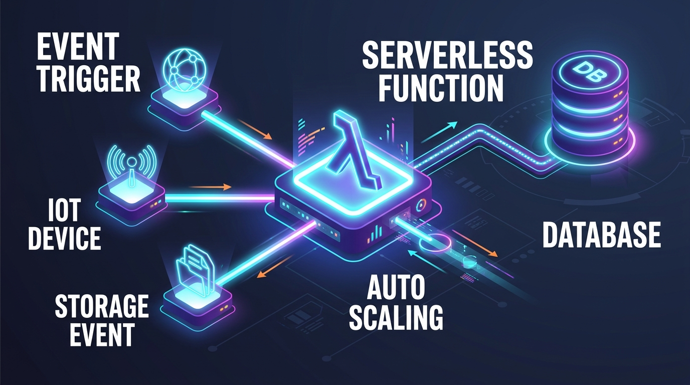
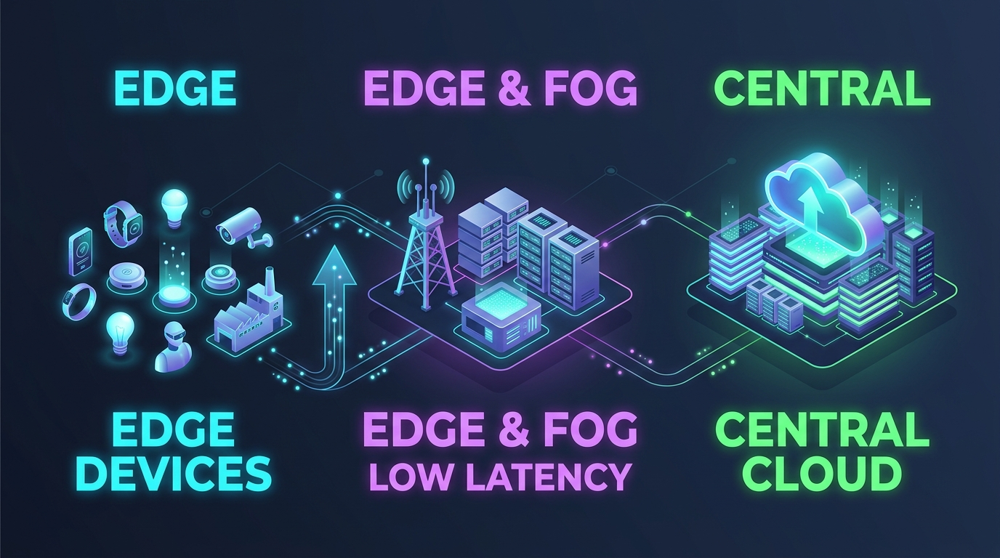

# Pertemuan 14: Tren Cloud Modern — Serverless, Edge Computing, dan Multi-Cloud

**Mata Kuliah:** Komputasi Awan (*Cloud Computing*)  
**Kode MK / Bobot:** TI433946 / 3 SKS  
**Sub-CPMK:** Mahasiswa mampu menguasai dan mempraktikkan Implementasi, Layanan Cloud, Tren, Isu, & Aplikasi Cloud Modern (Sub-CPMK 2 & 4).

---

## 1. Tujuan Pembelajaran
Setelah menyelesaikan materi pada pertemuan ini, mahasiswa diharapkan mampu:
1. Menjelaskan arsitektur **Serverless Computing** dan *Function as a Service (FaaS)*.
2. Menganalisis trade-off teknis arsitektur FaaS: masalah *Cold Start*, sifat *Stateless*, batas waktu eksekusi (*timeout*), dan model biaya *Scale-to-Zero*.
3. Membedakan peran **Edge Computing**, **Fog Computing**, dan **Centralized Cloud**.
4. Menguraikan strategi **Multi-Cloud** dan konsep dasar *Infrastructure as Code (IaC)* untuk mencegah *Vendor Lock-in*.
5. Mempraktikkan pembuatan fungsi serverless sederhana berbasis pemicu HTTP.

---

## 2. Paradigma Serverless Computing & FaaS

Filosofi utama komputasi *Serverless* adalah:
> *"Tidak ada server yang lebih mudah dikelola selain server yang tidak perlu Anda kelola sama sekali."*

Meskipun dinamakan "Serverless", bukan berarti server fisik ditiadakan, melainkan **seluruh lapisan sistem operasi, kapasitas server, dan penskalaan ditangani 100% secara otomatis oleh penyedia cloud**. Pengembang hanya bertugas menulis fungsi kode bisnis kecil (*Function as a Service / FaaS*).



```
+-------------------------------------------------------------------------+
|                  KARAKTERISTIK KUNCI ARSITEKTUR SERVERLESS              |
+-------------------------------------------------------------------------+
| 1. Zero Server Management  -> Tidak ada OS patching atau instalasi VM  |
| 2. Scale-to-Zero           -> 0 Request = 0 Server = Biaya Rp 0         |
| 3. Event-Driven Execution  -> Kode berjalan hanya saat dipicu event     |
| 4. Micro-Billing           -> Dihitung per milidetik durasi eksekusi    |
+-------------------------------------------------------------------------+
```

### 2.1 Perbandingan Siklus Hidup: VM vs Serverless

| Karakteristik | Virtual Machine (IaaS) | Serverless Function (FaaS) |
| :--- | :--- | :--- |
| **Model Biaya** | Bayar per jam/detik selama VM menyala (meskipun menganggur). | Hanya bayar saat fungsi sedang mengeksekusi kode. |
| **Penskalaan** | Otomatis tapi butuh waktu menit untuk boot VM baru. | Instan dalam hitungan milidetik menangani ribuan *request*. |
| **Batas Waktu** | Tidak terbatas (*Always-on*). | Terbatas (Maksimal 15 menit per eksekusi di AWS Lambda). |
| **Status (*State*)** | *Stateful* (Bisa menyimpan file di disk lokal). | *Stateless* (Data wajib disimpan di database eksternal). |

### 2.2 Fenomena *Cold Start* vs *Warm Start*
- **Cold Start:** Ketika fungsi dipanggil untuk pertama kali (atau setelah lama menganggur), penyedia cloud harus menyalakan container baru di belakang layar dan memuat pustaka runtime. Hal ini menyebabkan lonjakan latensi respons awal (sekitar 200 ms s.d. 2 detik).
- **Warm Start:** Jika ada request berikutnya yang masuk segera setelah request pertama, container yang sudah aktif digunakan kembali, sehingga eksekusi berlangsung sangat cepat (< 20 ms).

---

## 3. Edge Computing dan Fog Computing

Dengan semakin menjamurnya perangkat IoT dan kecerdasan buatan, mengirim seluruh data mentah ke data center cloud pusat yang berjarak ribuan kilometer menimbulkan masalah **latensi jaringan** dan **pemborosan bandwidth**.



```
[ KLIEN / SENSOR IoT ] -----> [ EDGE COMPUTING ] -----> [ CLOUD PUSAT ]
(Kamera CCTV, Mobil           (Gateway Lokal,           (Data Center Global:
 Otonom, Jam Pintar)           Pemrosesan Real-Time      Analitik Historis,
                               Latensi < 5 ms)           Model Training)
```

1. **Edge Computing:** Menjalankan pemrosesan data tepat di lokasi fisik sumber data berada (di router, kamera pintar, atau gateway industri).
   - *Use Case:* Kendaraan otonom (*self-driving cars*) yang harus mengerem dalam hitungan milidetik jika ada pejalan kaki; tidak mungkin menunggu transmisi sinyal bolak-balik ke cloud.
2. **Fog Computing:** Lapisan perantara yang menjembatani ribuan node Edge dengan Cloud Pusat.
3. **Cloud Pusat:** Tetap bertindak sebagai penyimpan data arsip jangka panjang (*Data Warehouse*) dan tempat melatih model AI skala besar.

---

## 4. Strategi Multi-Cloud & Infrastructure as Code (IaC)

Organisasi modern mulai mengadopsi strategi **Multi-Cloud** (menggunakan kombinasi AWS, GCP, dan Azure secara bersamaan) dengan motif:
1. Menghindari ketergantungan mutlak pada satu vendor (*Vendor Lock-in*).
2. Memanfaatkan keunggulan spesifik masing-masing vendor (misal: GCP unggul di Big Data & AI, AWS unggul di keanekaragaman layanan IaaS, Azure unggul di integrasi direktori perusahaan).
3. Redundansi ekstrem jika terjadi insiden mati total (*outage*) pada salah satu penyedia.

### Pengenalan Infrastructure as Code (IaC):
Agar tim tidak repot mengklik antarmuka web yang berbeda-beda di tiap penyedia, seluruh infrastruktur dituliskan dalam bentuk kode deklaratif menggunakan bahasa standar terbuka seperti **Terraform / OpenTofu**:

```hcl
# Contoh Kode Deklaratif Terraform untuk Multi-Cloud
resource "aws_s3_bucket" "penyimpanan_utama" {
  bucket = "data-kampus-primer"
}

resource "google_storage_bucket" "penyimpanan_cadangan" {
  name     = "data-kampus-sekunder-dr"
  location = "ASIA-SOUTHEAST2"
}
```

---

## 5. Praktikum Terpandu: Membuat Serverless Function Pertama

### 5.1 Kode Fungsi Python (Simulasi Pemicu HTTP)
Buat berkas kode fungsi Python sederhana `main.py`:

```python
import json
import datetime

def handler_pemrosesan_data(event, context):
    """
    Fungsi Serverless sederhana untuk menerima input JSON
    dan mengembalikan respons terformat.
    """
    waktu_sekarang = datetime.datetime.now().strftime("%Y-%m-%d %H:%M:%S")
    
    # Membaca parameter dari query atau body
    nama = "Pengguna Anonim"
    if "queryStringParameters" in event and event["queryStringParameters"]:
        nama = event["queryStringParameters"].get("nama", nama)
        
    pesan_respons = {
        "status": "Sukses",
        "pesan": f"Halo {nama}, fungsi serverless ini dieksekusi secara instan!",
        "timestamp": waktu_sekarang,
        "runtime": "Python 3.11 Serverless Engine"
    }
    
    return {
        "statusCode": 200,
        "headers": {
            "Content-Type": "application/json"
        },
        "body": json.dumps(pesan_respons)
    }
```

### 5.2 Langkah Pengujian:
1. Jalankan fungsi di konsol AWS Lambda / Google Cloud Functions.
2. Atur pemicu (*Trigger*) menggunakan **Function URL** atau **API Gateway**.
3. Akses URL pemicu melalui peramban: `https://<endpoint-fungsi>?nama=Mahasiswa`
4. Amati bahwa sistem hanya menghitung durasi eksekusi beberapa milidetik saja!

---

## 6. Latihan Kasus Analisis Biaya FinOps (Studi Kasus 4)

### Kasus Proyek "Smart City":
Pemerintah kota memasang **50.000 sensor suhu** di seluruh penjuru kota. Setiap sensor hanya mengirim data satu kali setiap 1 jam, atau jika suhu melebihi 40°C. 
- **Opsi A:** Menjalankan 5 unit Virtual Machine (EC2 `t3.medium`) yang menyala terus-menerus 24 jam sehari selama sebulan penuh.
- **Opsi B:** Menggunakan arsitektur Serverless (AWS Lambda + API Gateway) di mana fungsi hanya menyala saat ada paket data dari sensor yang masuk.

### Tugas Analisis Mahasiswa:
1. Hitung total jumlah pemanggilan fungsi per bulan ($50.000 \times 24 \times 30$)!
2. Mengapa model Serverless jauh lebih hemat biaya dibandingkan opsi Virtual Machine yang menyala terus-menerus (*Always-on*)?
3. Apa kelemahan potensial dari Serverless yang perlu diwaspadai jika 50.000 sensor tersebut mengirimkan data secara serentak persis pada detik yang sama (*Concurrency Spike*)?
