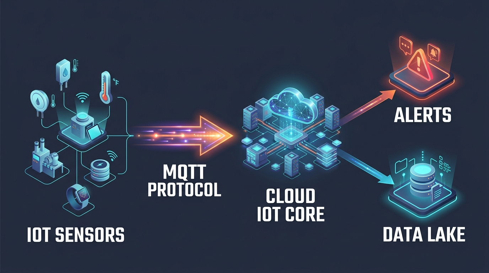
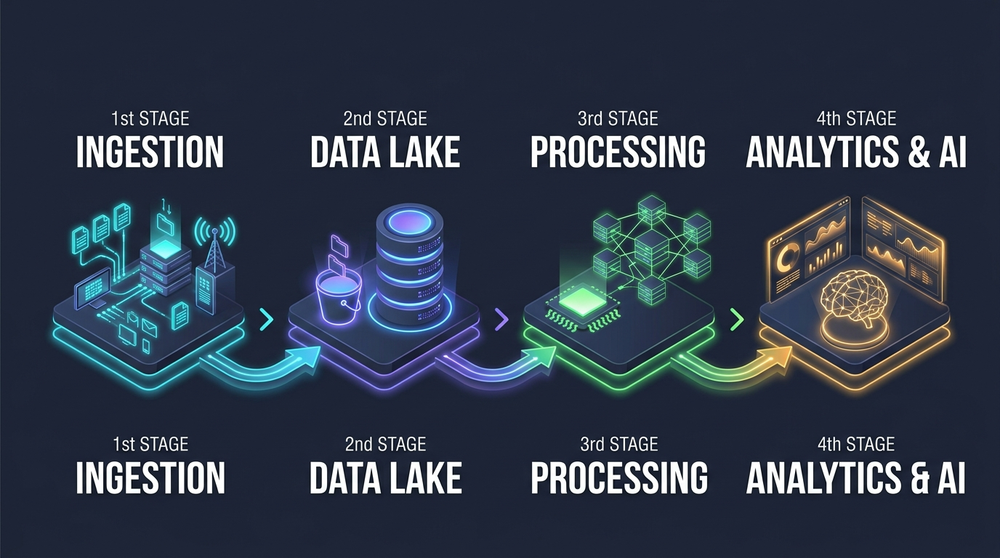

# Pertemuan 15: Integrasi Cloud-Native (IoT, Big Data, dan Cloud AI)

**Mata Kuliah:** Komputasi Awan (*Cloud Computing*)  
**Kode MK / Bobot:** TI433946 / 3 SKS  
**Sub-CPMK:** Mahasiswa mampu memahami dan mempraktikkan Implementasi, Layanan Cloud, Tren, Isu, & Aplikasi Cloud Modern (Sub-CPMK 2 & 4).  
*(Catatan: Modul ini mengintegrasikan materi Pertemuan 15 & Pertemuan 16 RPS: Integrasi Cloud dengan IoT & Big Data, Beban Kerja Cloud AI Modern, Review Komprehensif Semester, serta Latihan Studi Kasus Terintegrasi).*

---

## 1. Tujuan Pembelajaran
Setelah menyelesaikan materi pada pertemuan ini, mahasiswa diharapkan mampu:
1. Merancang arsitektur integrasi komputasi awan dengan ekosistem **Internet of Things (IoT)** menggunakan protokol MQTT.
2. Memahami alur pipa data (*Big Data Pipeline*) dari penyerapan data (*ingestion*), penyimpanan (*Data Lake*), hingga pemrosesan analitik.
3. Menganalisis kebutuhan infrastruktur cloud modern untuk beban kerja **Kecerdasan Buatan (AI/LLM)** dan akselerasi GPU.
4. Menghubungkan kembali seluruh konsep dari Pertemuan 01 hingga 15 dalam peta konsep komprehensif.
5. Menganalisis dan menyelesaikan studi kasus arsitektur cloud terintegrasi (*Case-Based Learning*).

---

## 2. Arsitektur Integrasi Cloud dengan Internet of Things (IoT)

Perangkat IoT memiliki keterbatasan daya komputasi dan energi baterai. Cloud bertindak sebagai "otak terpusat" untuk agregasi, penyimpanan, dan analisis data dari jutaan sensor.



```
[ PERANGKAT SENSOR IoT ] 
(ESP32, Raspberry Pi, Sensor Suhu)
          |
          v (Protokol Ringan MQTT via TLS)
+-------------------------------------------------------------------------+
| CLOUD IoT CORE / MESSAGE BROKER                                         |
|  - Mengelola autentikasi jutaan sertifikat perangkat (X.509)            |
|  - Menyimpan status terakhir perangkat di memori (Device Shadow / Twin) |
|  - Rule Engine: Memilah pesan berdasarkan topik (Topic Publish/Subscribe)
+-------------------------------------------------------------------------+
          |
          +---> [ Analisis Anomali Instan ] ----> Peringatan SMS/Email
          |
          +---> [ Pipa Big Data Storage ]   ----> Data Lake (S3/GCS)
```

### Protokol MQTT vs HTTP untuk IoT:
- **HTTP:** Berorientasi koneksi tunggal (*Request-Response*), header paket besar (~1 KB), boros bandwidth dan baterai sensor.
- **MQTT (*Message Queuing Telemetry Transport*):** Berorientasi *Publish-Subscribe*, header paket ultra-ringan (hanya 2 byte), sangat hemat daya, berjalan di atas koneksi TCP yang persisten.

---

## 3. Pipa Big Data di Komputasi Awan (*Big Data Pipeline*)

Cloud computing adalah platform paling ideal untuk pemrosesan Big Data karena kapasitas penyimpanan dan komputasinya dapat diskalakan secara independen (*Decoupled Storage and Compute*):



```
1. INGESTION           2. STORAGE            3. PROCESSING         4. ANALYTICS
[ Apache Kafka /  ] -> [ Data Lake (S3) / ] -> [ Spark / EMR / ] -> [ BI Dashboards /]
[ AWS Kinesis     ]    [ Cloud Storage    ]    [ BigQuery      ]    [ Looker / Grafana]
(Jutaan event/detik)   (Penyimpanan Murah)     (Komputasi Paralel)  (Keputusan Bisnis)
```

1. **Data Lake vs Data Warehouse:**
   - **Data Lake (Object Storage):** Menyimpan seluruh data mentah (*raw data*) dalam berbagai format (JSON, CSV, Log, Parquet, Gambar) tanpa struktur skema kaku (*Schema-on-Read*).
   - **Data Warehouse (Relasional Terdistribusi):** Menyimpan data terstruktur yang sudah dibersihkan (*Cleaned Data*) dan siap di-query untuk laporan eksekutif (*Schema-on-Write*).

---

## 4. Komputasi Awan Modern untuk Beban Kerja AI & GPU

Tren terbesar dalam industri cloud computing saat ini adalah penyediaan infrastruktur untuk melatih (*training*) dan melayani (*inference*) model AI berskala besar (*Large Language Models / LLM*):

```
+-------------------------------------------------------------------------+
|                  ARSITEKTUR INFRASTRUKTUR CLOUD AI MODERN               |
+-------------------------------------------------------------------------+
| Lapisan 3: Model-as-a-Service (FaaS AI) -> OpenAI API, Bedrock, Vertex |
| Lapisan 2: MLOps & Managed Cluster     -> Kubeflow, Ray on Kubernetes   |
| Lapisan 1: GPU Hardware Infrastructure -> NVIDIA H100/A100 + InfiniBand |
+-------------------------------------------------------------------------+
```

1. **GPU-as-a-Service:** Menyewa klaster kartu grafis akselerator secara elastis per jam untuk melatih model deep learning tanpa harus membeli perangkat keras server AI yang bernilai miliaran rupiah.
2. **Jaringan Ultra Cepat (InfiniBand / RoCE):** Antar-node GPU membutuhkan interkoneksi jaringan berkecepatan 400–800 Gbps dengan latensi sub-mikrodetik agar gradien bobot model neural network dapat disinkronkan secara instan.

---

## 5. Peta Konsep Komprehensif Semester (Review Kuliah)

```
[ PERTEMUAN 01 - 03 ] : FONDASI & ARSITEKTUR
- Karakteristik NIST, CAPEX vs OPEX, Teorema CAP, Arsitektur Front/Back End, Regions & AZs.

[ PERTEMUAN 04 - 05 ] : MODEL BISNIS & MIGRASI
- Model SPI (IaaS, PaaS, SaaS), Model Deployment (Public, Private, Hybrid), Kerangka Migrasi 6R.

[ PERTEMUAN 06 - 07 ] : VIRTUALISASI & CLOUD-NATIVE
- Hypervisor Tipe 1 vs 2, Linux Namespaces & cgroups, Praktek Build Cluster Kubernetes (K3s).

[ PERTEMUAN 09 - 10 ] : KEANDALAN & PERFORMA
- Skalabilitas Vertikal vs Horizontal, Auto-Scaling Groups, Algoritma Load Balancing, Matematika SLA.

[ PERTEMUAN 11 - 12 ] : KEAMANAN & TATA KELOLA
- Shared Responsibility Model, IAM Least Privilege, Enkripsi Data, UU PDP No. 27/2022, FinOps.

[ PERTEMUAN 13 - 15 ] : IMPLEMENTASI PRAKTIS & TREN MASA DEPAN
- Deployment Public Cloud, Paradigma Serverless (Scale-to-Zero), Edge Computing, IoT & Cloud AI.
```

---

## 6. Latihan Studi Kasus Terintegrasi (*Case-Based Learning*)

Untuk menguji dan memperdalam pemahaman menyeluruh terhadap arsitektur komputasi awan dari Pertemuan 01 hingga 15, mahasiswa dapat berlatih menyelesaikan skenario studi kasus nyata berikut secara mandiri maupun berkelompok.

### Petunjuk Latihan:
Pilihlah salah satu skenario kasus di bawah ini untuk merancang cetak biru arsitektur (*Architectural Blueprint*) komprehensif yang mencakup aspek skalabilitas, keamanan, ketersediaan tinggi, dan efisiensi biaya.

---

### Pilihan Skenario Kasus Latihan:

#### KASUS 1: Arsitektur Skalabilitas E-Commerce "CepatBeli"
- **Tantangan:** Menangani lonjakan trafik 10x lipat saat kampanye diskon kilat (*Flash Sale*).
- **Output yang Diharapkan:**
  1. Diagram arsitektur Auto-Scaling Group dan Layer 7 Load Balancer di Public Cloud.
  2. Strategi pemisahan sesi pengguna (Stateless app dengan Redis cache).
  3. Estimasi perhitungan ketersediaan sistem SLA 99.99%.

#### KASUS 2: Implementasi Hybrid Cloud Sektor Finansial Bank "Artha Aman"
- **Tantangan:** Mengintegrasikan Core Banking on-premise lokal yang patuh UU PDP dengan kemudahan aplikasi mobile banking di cloud publik.
- **Output yang Diharapkan:**
  1. Topologi interkoneksi jaringan aman (Dedicated Direct Connect vs IPsec VPN).
  2. Kebijakan keamanan IAM dan enkripsi data *at-rest* (KMS) & *in-transit* (TLS 1.3).
  3. Matriks kepatuhan regulasi data perbankan nasional.

#### KASUS 3: Modernisasi Aplikasi Monolitik ke Microservices pada Perusahaan Logistik
- **Tantangan:** Menghilangkan *downtime* saat update fitur pelacakan barang dengan migrasi ke container.
- **Output yang Diharapkan:**
  1. Desain arsitektur klaster Kubernetes multi-node.
  2. Berkas manifest deklaratif (Deployment, Service, PVC).
  3. Simulasi strategi *Zero Downtime Deployment* (Rolling Update).

#### KASUS 4: Optimasi Biaya IoT Smart City dengan Arsitektur Serverless
- **Tantangan:** Mengurangi biaya operasional dari 50.000 sensor berkala yang memboroskan server *always-on*.
- **Output yang Diharapkan:**
  1. Diagram alur data dari sensor IoT (MQTT) -> Serverless Function -> Data Lake.
  2. Analisis perbandingan kalkulasi biaya (FinOps) bulanan: Virtual Machine vs Serverless FaaS.
  3. Strategi penanganan lonjakan trafik serentak (*concurrency limit & cold start*).
